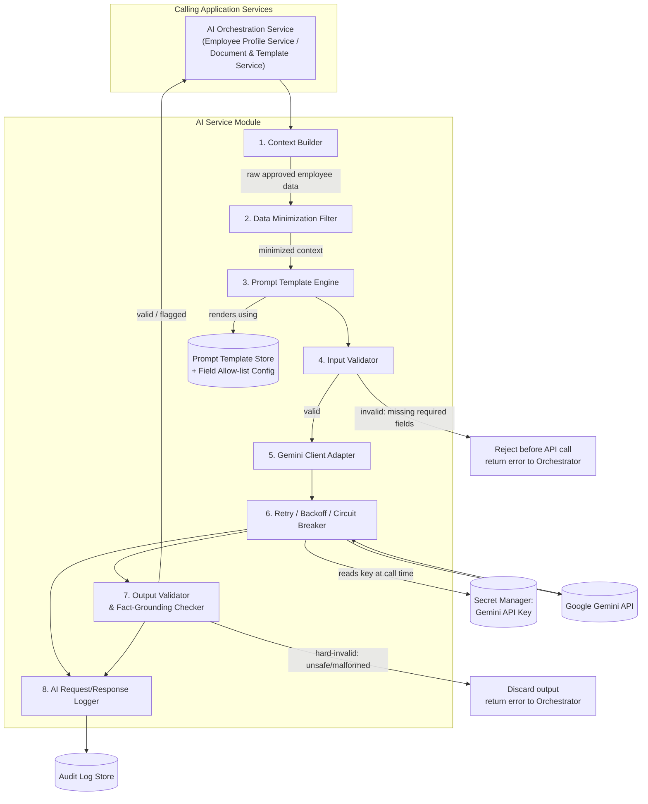
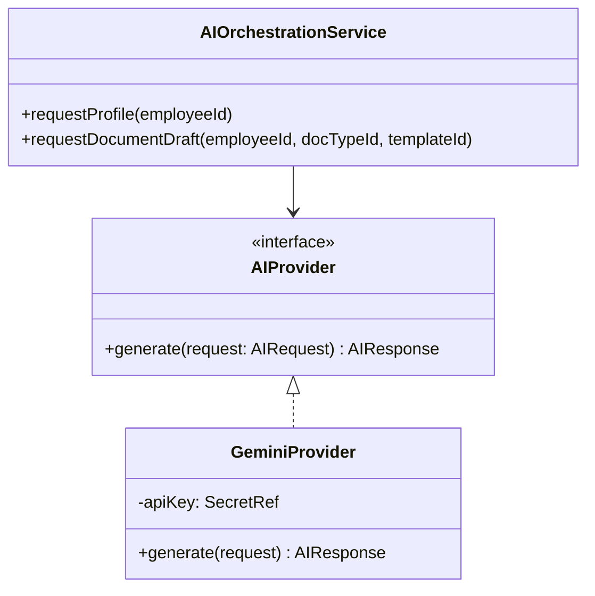
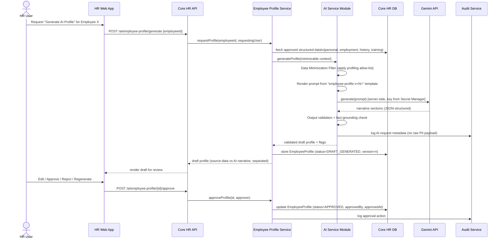
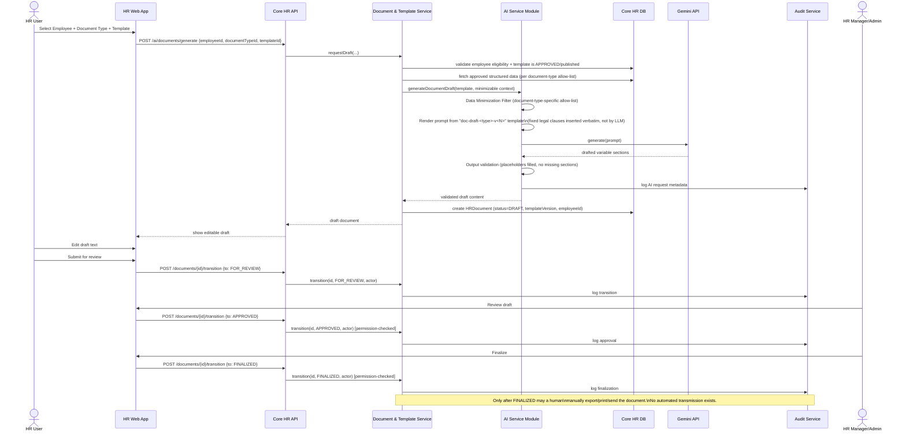
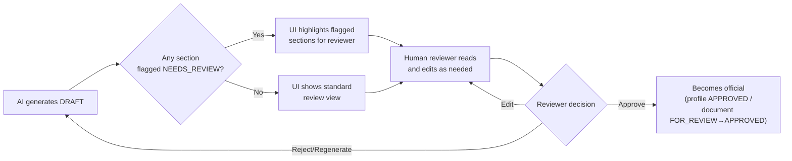

# Core HR (Group 4) — AI Service Architecture

Covers Gemini integration design, the two AI-assisted workflows (Employee Profiling and
Document Drafting), safety/validation strategy, data privacy strategy, and AI-specific
audit logging.

**Related documents:**
[`requirements.md`](./requirements.md) ·
[`architecture.md`](./architecture.md) ·
[`database-design.md`](./database-design.md) ·
[`integration-contract.md`](./integration-contract.md)

---

## 1. Guiding Rule: AI Is Assistive Only

Every design decision in this document enforces one non-negotiable constraint from the
project brief:

> The AI must not autonomously make employment decisions, approve HR actions, modify
> employee records, or send official documents without authorized human review and
> approval.

Concretely, this is enforced architecturally (not just by convention) as follows:

- The AI Service Module has **no database write permission** on any authoritative
  table (`Employee`, `EmploymentInfo`, `EmploymentHistory`, `Department`, `Position`,
  `Branch`). It can only produce data that the Application layer stores in `DRAFT`
  status records (`EmployeeProfile.status = DRAFT`, `HRDocument.status = DRAFT`).
- The AI Service Module has **no capability/credentials to invoke** approval,
  finalize, or "send/transmit" endpoints. Those endpoints require an authenticated
  human user session with the corresponding RBAC permission (§4.5 in
  `requirements.md`); there is no service account or internal caller that can hit them
  programmatically as a side effect of generation.
- Every transition beyond `DRAFT` requires an explicit action from an authorized human
  actor, recorded in the audit trail with that actor's identity.

---

## 2. AI Service Module — Internal Architecture

### 2.1 Component responsibilities

| # | Component | Responsibility |
|---|---|---|
| 1 | **Context Builder** | Given an employee ID + task type, fetches the *approved* structured data needed (via the Application layer, never raw DB access) — e.g., current employment info, employment history, active documents/training records. |
| 2 | **Data Minimization Filter** | Applies the per-task field allow-list (§6) to the fetched data; strips or masks any field not explicitly allowed for this task before it ever reaches a prompt string. |
| 3 | **Prompt Template Engine** | Loads a versioned prompt template (system instructions + user-turn structure) from the Prompt Template Store and interpolates the minimized context into it. Templates are data/config, not hardcoded strings, so they can be reviewed/edited without a code deploy. |
| 4 | **Input Validator** | Checks structural preconditions before spending an API call: required fields present, employee status eligible for requested task/document type, template exists and is approved/published. |
| 5 | **Gemini Client Adapter** | The *only* component holding a reference to the Gemini API key (fetched from the Secret Manager at call time, never logged, never cached in plaintext beyond process memory). Wraps the Gemini SDK/API behind an internal `AIProvider` interface. |
| 6 | **Retry / Backoff / Circuit Breaker** | Retries transient failures (timeouts, 5xx, rate-limit 429) with exponential backoff up to a max attempt count; opens a circuit breaker after repeated failures to fail fast and protect the rest of the platform. |
| 7 | **Output Validator & Fact-Grounding Checker** | Validates the response against an expected structure (e.g., JSON-schema'd sections for profiles, expected placeholders filled for documents); runs a grounding heuristic that extracts named entities/dates/numbers from the AI output and checks they appear in the supplied context, flagging anything that doesn't. |
| 8 | **AI Request/Response Logger** | Writes a privacy-aware audit record (§7) for every attempt, success, or failure — never the full raw prompt/response when it contains personal data. |

### 2.2 Provider abstraction

The Application layer only ever depends on the `AIProvider` interface, not on the
Gemini SDK directly. This satisfies `NFR-MAINT-01` (provider swap-ability) and keeps
all Gemini-specific concerns (auth, request/response shape, model selection) inside
`GeminiProvider`.

### 2.3 Token / context management

- Each prompt template declares an approximate token budget per section (e.g., system
  instructions, structured context block, output format instructions).
- The Context Builder truncates variable-length lists (e.g., employment history) to the
  most recent/relevant N entries (`ASSUMPTION`: N to be tuned, default suggestion 10)
  when the full history would exceed the budget, preferring recency and materiality
  (promotions/transfers) over routine entries.
- If, after minimization and truncation, required data still cannot fit the model's
  context window, the request fails input validation with an explicit
  "context too large" error rather than silently dropping required facts.

### 2.4 Error handling

| Failure class | Handling |
|---|---|
| Gemini API timeout / 5xx | Retry with exponential backoff (e.g., 3 attempts: 1s, 3s, 8s `ASSUMPTION`: exact backoff schedule tunable). |
| Gemini API 429 (rate limit) | Retry with backoff honoring `Retry-After` if provided; surface a "please try again shortly" UI state if exhausted. |
| Gemini API 4xx (bad request/auth) | No retry (non-transient); log and surface a generic error; alert on auth failures (possible credential issue). |
| Output fails schema validation | No retry by default; return to Orchestrator as a generation failure; user may manually retry. |
| Output fails fact-grounding check | Not treated as a hard failure — the `DRAFT` is still created, but the relevant section(s) are flagged `NEEDS_REVIEW` in the UI so the human reviewer pays closer attention (per `FR-PROF-09`). |
| Circuit breaker open | Immediate fail-fast with "AI service temporarily unavailable" message; non-AI features remain unaffected. |

### 2.5 Safety controls (platform-level)

- **System-level instructions** on every prompt reinforce: "Only use the facts provided
  below. Do not invent names, dates, numbers, or qualifications. If information is
  insufficient for a section, state that it is not available rather than guessing."
- **Content safety filtering**: rely on Gemini's built-in safety settings
  (harassment/hate/sexual/dangerous content categories) configured to at least the
  platform default blocking thresholds; additionally apply a lightweight
  organization-specific denylist check on output (e.g., discriminatory language
  patterns) before returning to the UI `(ASSUMPTION: exact denylist/policy to be
  defined with HR/compliance)`.
- **No autonomous tool use**: Gemini is called in plain text-generation mode only; it
  is never granted function-calling/tool-use access to the database, filesystem, or any
  internal API. It cannot take any action beyond returning text.
- **Deterministic templates for legal boilerplate**: where a document type has fixed
  legal/compliance wording (e.g., statutory clauses), that wording is inserted directly
  by the template engine (not generated by the LLM), and the LLM is only asked to draft
  the variable narrative portions (e.g., a promotion rationale paragraph).

---

## 3. AI Employee Profiling Workflow (Detailed)

### 3.1 Sequence

### 3.2 Fields used (profiling task)

See §6.2 for the authoritative allow-list. At a high level: name, current
position/department/branch, employment dates, employment history events (type +
effective date + brief reason category, not free-text), completed trainings/
certifications (title + date, if tracked), and any HR-approved "skills/competencies"
tags already stored in structured form. No free-text notes, no identifiers beyond
internal employee ID, no contact/financial/government-ID data.

### 3.3 Source Data vs. AI-Generated content separation

The `EmployeeProfile` record (see `database-design.md`) explicitly separates:

- **`sourceDataSnapshot`** — a structured, queryable copy of exactly which facts were
  used (field name → value → originating table/record reference), captured at
  generation time for traceability, even if the underlying employee record later
  changes.
- **`aiGeneratedSections`** — the narrative text per section (professional summary,
  employment history summary, etc.), each tagged with a `groundingStatus`
  (`GROUNDED` / `NEEDS_REVIEW`) from the Output Validator.

The UI renders these in visually distinct blocks (e.g., a "Verified Data" panel vs. an
"AI-Generated Narrative — Pending Review" panel with a persistent badge), satisfying
`FR-PROF-04` and `NFR-USE-01`.

### 3.4 Review & versioning

- A generated profile starts at `DRAFT_GENERATED`.
- The reviewing HR user may edit narrative text directly, click "Regenerate" (re-runs
  the workflow, discarding the prior draft), or "Approve."
- On approval, the profile becomes `APPROVED` and is versioned (`v1`, `v2`, ...) against
  the employee; the previous approved version (if any) is retained, not deleted, for
  audit/history purposes.
- An `APPROVED` profile is what may be surfaced elsewhere in Core HR (e.g., an
  "Employee 360 view") or, subject to `integration-contract.md`, read by other groups —
  never a `DRAFT_GENERATED` one.

---

## 4. AI Document Drafting Workflow (Detailed)

### 4.1 Sequence

### 4.2 Fields used (document drafting task)

Varies by document type; see §6.3 for the representative allow-list per document type.
General principle: only the fields the specific document legally/practically needs
(e.g., a Certificate of Employment needs name, position, department, hire date,
employment status — not emergency contacts or government IDs).

### 4.3 Document lifecycle — detailed rules

| Transition | Trigger | Who | Guardrail |
|---|---|---|---|
| *(none)* → `DRAFT` | AI generation completes, or HR user manually starts a blank document | HR Staff/Manager/Admin | AI cannot skip this state; every generation lands here first. |
| `DRAFT` → `DRAFT` | Content edit | HR Staff/Manager/Admin (creator or assignee) | Full edit history retained (§4.4). |
| `DRAFT` → `FOR_REVIEW` | "Submit for review" | HR Staff/Manager/Admin | Requires all mandatory template fields to be non-empty. |
| `FOR_REVIEW` → `DRAFT` | "Send back for edits" | HR Manager/Admin | Reviewer comment required `(ASSUMPTION: whether comment is mandatory is a UX decision, recommended for traceability)`. |
| `FOR_REVIEW` → `APPROVED` | "Approve" | HR Manager/Admin only (`ai.document.approve` permission) | Cannot be the same user who only has Staff-level permission; system checks RBAC, not self-approval by a Staff user. |
| `APPROVED` → `FINALIZED` | "Finalize" | HR Manager/Admin only (`ai.document.finalize` permission) | Locks content from further edits; generates the final rendered artifact (e.g., PDF) `(ASSUMPTION: rendering/export format)`. |
| `APPROVED` → `DRAFT` | "Revoke approval" (exceptional) | HR Admin only | Heavily audited; reason required. |
| `FINALIZED` → `ARCHIVED` | "Archive" | HR Manager/Admin | For records retention; archived documents remain readable but not editable. |

### 4.4 Draft history

Every AI generation call, every manual edit, and every status transition is appended
to `DocumentDraftHistory` (see `database-design.md`), preserving: actor, timestamp,
previous status → new status (if a transition), and a content diff or full snapshot
reference (`ASSUMPTION`: diff vs. full snapshot storage is an implementation choice;
full snapshot is simpler and recommended given expected document volume).

---

## 5. AI Safety and Validation Strategy

### 5.1 Input validation (pre-call)

1. Employee exists and is in an eligible status for the requested task/document type
   (e.g., cannot generate a "Certificate of Employment" for a `TERMINATED` employee
   dated after their last working day, without an explicit override flag).
2. Template exists, is of status `APPROVED`/published, and matches the requested
   document type.
3. All fields the template marks as `required` are present and non-null in the
   minimized context; if not, generation is rejected before any Gemini call is made
   (saves cost and avoids the AI "filling gaps" with invented content).
4. Requesting user holds the relevant permission (`ai.profile.generate` /
   `ai.document.generate`).

### 5.2 Output validation (post-call)

1. **Structural validation** — response must parse into the expected structure
   (e.g., JSON with named sections, or template placeholders all filled); malformed
   output is rejected and not shown to the user as a draft (or, alternatively,
   retried once automatically before failing).
2. **Fact-grounding check** — extract candidate entities (dates, numbers, proper
   nouns, job titles) from the AI output and verify each appears in the supplied
   context; unmatched entities are flagged inline (`NEEDS_REVIEW`) rather than
   silently trusted or silently deleted.
3. **Prohibited-content check** — lightweight policy check (defamatory/discriminatory
   language, promises/guarantees the organization cannot make, etc.)
   `(ASSUMPTION: exact policy rules pending HR/legal input)`.
4. **Length/format check** — output within expected length bounds for the target
   document/section to avoid runaway or truncated generations.

### 5.3 Human review workflow (both AI features)

No path exists from `Gen` directly to `Official` — every path passes through `Review`
with an explicit human `Decision`.

### 5.4 Model & prompt governance

- Prompt templates are versioned (`employee-profile-v3`, `doc-draft-coe-v2`, etc.) and
  stored as reviewable configuration/data, not code, so HR/compliance can review
  wording without needing a deployment.
- Every stored AI request references the exact template version and Gemini model
  identifier used, enabling reproducibility and post-incident analysis
  (`FR-AI-08`).
- Prompt/template changes should go through a lightweight internal review process
  before publishing `(ASSUMPTION: exact governance process — who approves prompt
  changes — pending client input; recommend at minimum HR Admin sign-off)`.

---

## 6. Data Privacy Strategy — Field-Level Data Minimization

### 6.1 Employee field sensitivity classification

| Sensitivity tier | Examples | Default AI eligibility |
|---|---|---|
| **Tier 0 — Never sent to AI** | Password hash, auth tokens/session data, MFA secrets | Excluded always, hard-coded exclusion, not configurable |
| **Tier 1 — Highly sensitive, excluded by default** | Government IDs (SSS, TIN, PhilHealth, Pag-IBIG, passport, driver's license), bank/financial account numbers, payroll salary figures, medical/health information, religion, civil status (if classified as sensitive personal info under applicable law) | Excluded from all current AI tasks; would require an explicit, documented business justification + allow-list entry to ever include |
| **Tier 2 — Sensitive, situational** | Home address, personal phone/email, emergency contact details, date of birth | Excluded from profiling/drafting tasks in this design (not needed for any current document type or profile section); revisit only if a specific approved document type requires it (e.g., an address field on a specific letter) |
| **Tier 3 — Low-sensitivity structured facts** | Full name, employee ID, department, position, branch, hire date, employment status, employment history event types + dates, training/certification titles + dates | Eligible per-task allow-list (see below) |

### 6.2 Allow-list — AI Feature 1: Employee Profiling

| Field | Included? | Notes |
|---|---|---|
| Full name | ✅ | Needed for narrative personalization |
| Employee ID | ✅ (internal only) | For traceability, not shown as a "sensitive ID" |
| Current department / position / branch | ✅ | Core to role/responsibility summary |
| Hire date, tenure | ✅ | Core to employment history summary |
| Employment history events (type, effective date, category) | ✅ | Free-text "reason" notes excluded; only categorical reason codes included |
| Training/certification records (title, date, provider) | ✅ (if structured) | Only if captured as structured fields, not free-text notes |
| Structured skill/competency tags | ✅ (if structured) | Only pre-approved structured tags, not inferred from unrelated free text |
| Performance ratings / appraisal scores | ❌ | Owned by Group 8; not part of Core HR scope and not passed even if available via integration, unless a future explicit requirement adds it with client sign-off |
| Contact info (phone/email/address) | ❌ | Not needed for any profile section |
| Emergency contacts | ❌ | Not relevant to a professional profile |
| Government IDs | ❌ | Tier 1 exclusion |
| Financial/bank data | ❌ | Tier 1 exclusion; also not stored in Core HR at all (owned by Group 6) |
| Free-text HR notes/remarks fields | ❌ | Risk of prompt injection / unintended sensitive disclosure; excluded categorically |

### 6.3 Allow-list — AI Feature 2: Document Drafting (representative examples)

| Document type | Fields sent to AI |
|---|---|
| Certificate of Employment | Name, employee ID, position, department, branch, hire date, employment status, (if resigned/terminated) last working day |
| Appointment Letter | Name, position, department, branch, hire date, employment type, reporting manager name |
| Promotion Letter | Name, prior position, new position, new department (if changed), effective date, approving manager name |
| Transfer Letter | Name, prior department/branch, new department/branch, effective date, approving manager name |
| HR Memorandum | Depends on memo purpose; default to name + department only, with any case-specific detail entered manually by the HR author rather than pulled automatically `(ASSUMPTION: memoranda are often free-form; default posture is minimal auto-population)` |
| Notice Letter | Name, department, position, notice reason **category** (not free-text detail), effective date |

`ASSUMPTION`: Exact field requirements per document type must be validated against
real template drafts once HR/legal supplies them; the table above is a reasonable
default consistent with data-minimization principles, not a final legal spec.

### 6.4 Enforcement mechanism

- The allow-list is implemented as **configuration data** keyed by task type/document
  type (not scattered `if` statements), so it is auditable and centrally reviewable.
- The Data Minimization Filter operates as a **deny-by-default whitelist**: any field
  present in the fetched employee data that is *not* explicitly listed for the current
  task is dropped before the Prompt Template Engine ever sees it. This means new
  fields added to the `Employee` entity in the future are automatically excluded from
  AI context until someone deliberately adds them to an allow-list.
- Free-text fields (notes, remarks) are excluded from every current allow-list to
  mitigate prompt-injection risk from user-entered content.

---

## 7. AI Request Logging & Audit Strategy

### 7.1 What is logged

Per `FR-AUD-02`–`FR-AUD-04`, every AI call produces an `AIRequestLog` record (see
`database-design.md`) capturing:

| Field | Captured? | Notes |
|---|---|---|
| Acting user | ✅ | Who triggered generation |
| Timestamp(s) | ✅ | Requested-at, responded-at |
| Employee affected | ✅ | Employee ID reference |
| AI feature used | ✅ | `PROFILING` \| `DOCUMENT_DRAFTING` |
| Prompt template ID + version | ✅ | For reproducibility/governance |
| Model identifier/version | ✅ | e.g., `gemini-<version>` |
| Result status | ✅ | `SUCCESS` \| `VALIDATION_FAILED` \| `PROVIDER_ERROR` \| `NEEDS_REVIEW_FLAGGED` |
| Token/usage counts | ✅ (if provided by API) | For cost monitoring |
| Fields included (by name, not value) | ✅ | E.g., `["fullName","position","hireDate"]` — records *which* allow-listed fields were sent, for compliance review, without storing the sensitive values themselves in the log |
| Raw prompt text | ❌ by default | Not persisted long-term because it embeds personal data; may be held in short-lived operational logs with strict retention/access controls for debugging only `(ASSUMPTION: short-term debug log retention window, e.g., 7–30 days, pending infra/security policy)` |
| Raw response text | ❌ by default | Same rationale; the *structured, validated* output is instead persisted as part of the `EmployeeProfile`/`HRDocument` record itself (which already has its own access controls), not duplicated into the audit log |
| Approval/decision action | ✅ | Recorded as a related `HRAuditLog` entry when the human reviews/approves |

This satisfies the brief's explicit instruction: *"Do not unnecessarily store raw
sensitive AI prompts or responses if they contain sensitive employee information."*
The system instead logs **metadata sufficient for audit and reproducibility** (who,
what task, which template/model version, which fields, what outcome) while keeping the
actual generated content only inside the domain record it belongs to (profile/
document), governed by that record's own RBAC.

### 7.2 Relationship between `AIRequestLog` and `HRAuditLog`

- `AIRequestLog` is a specialized, AI-feature-specific log capturing the technical
  generation event (§7.1).
- `HRAuditLog` is the general-purpose Core HR audit trail (see
  `database-design.md` §5) capturing business-level actions, including human review
  decisions (approve/reject/finalize) on AI-generated artifacts.
- A single end-to-end AI-assisted action therefore produces: one `AIRequestLog` entry
  (the generation attempt) + one or more `HRAuditLog` entries (the generation request
  as a business event, plus each subsequent human review/approval/finalize action).
  They are linked via a shared correlation ID.

### 7.3 Audit log integrity

- Both log types are append-only from the application's perspective (`FR-AUD-05`); no
  UPDATE/DELETE endpoints are exposed for them.
- `ASSUMPTION`: Whether additional tamper-evidence (e.g., hash chaining, WORM storage)
  is required depends on the client's compliance posture; flagged here as an option to
  revisit, not assumed as a hard requirement for the initial build.

---

*End of `ai-architecture.md`. See [`database-design.md`](./database-design.md) for the
`EmployeeProfile`, `HRDocument`, `AIRequestLog`, and `HRAuditLog` schemas referenced
above.*
