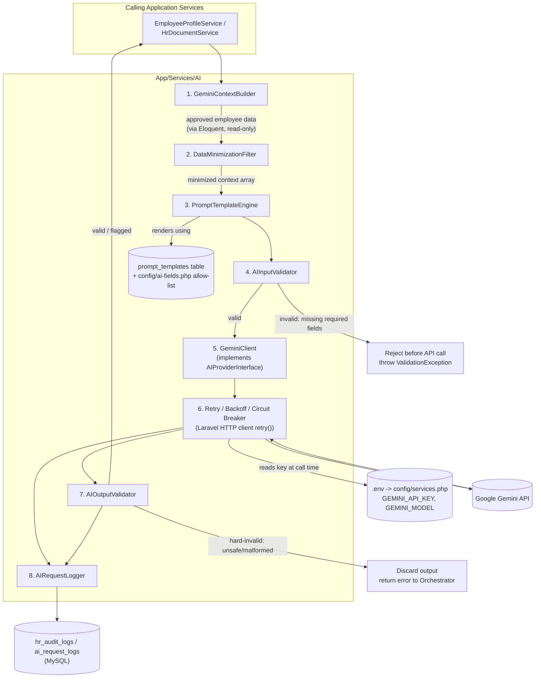
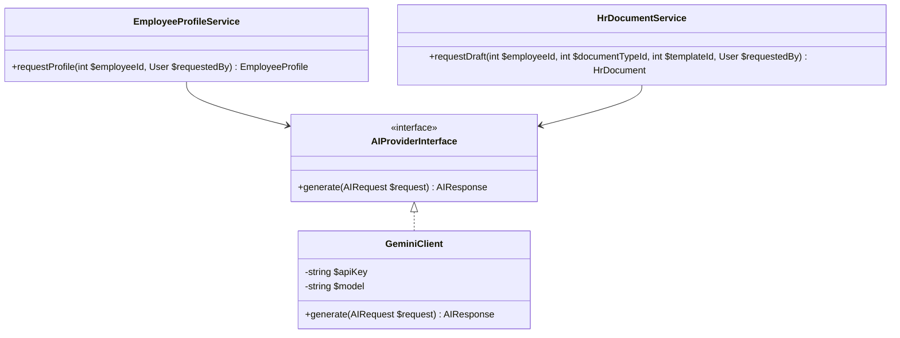
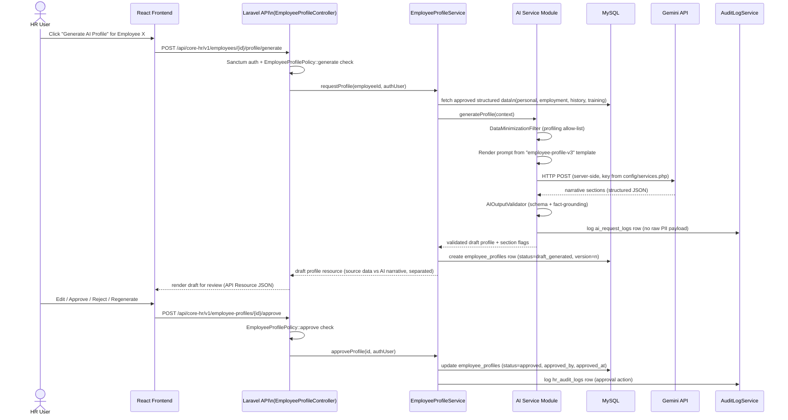
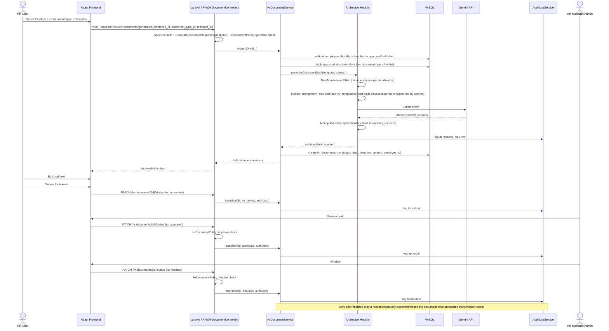
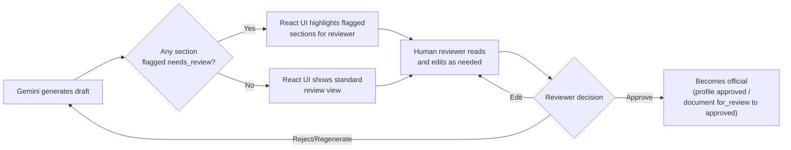

# Core HR (Group 4) — AI Service Architecture (Laravel + Gemini)

Covers the Laravel-side Gemini integration design, the two AI-assisted workflows
(Employee Profiling and Document Drafting), safety/validation strategy, data privacy
strategy, and AI-specific audit logging. This document describes **architecture and
design only** — no application code is implemented as part of this phase (see
[`project-analysis.md`](./project-analysis.md)).

**Related documents:**
[`requirements.md`](./requirements.md) ·
[`architecture.md`](./architecture.md) ·
[`database-design.md`](./database-design.md) ·
[`api-contract.md`](./api-contract.md) ·
[`integration-contract.md`](./integration-contract.md)

---

## 1. Guiding Rule: AI Is Assistive Only

Every design decision in this document enforces one non-negotiable constraint from the
task brief:

> Gemini must not make employment decisions, automatically approve employees,
> automatically promote employees, automatically terminate employees, modify employee
> database records, or automatically send official HR documents. All AI-generated
> content must go through human review.

Concretely, this is enforced architecturally (not just by convention) as follows:

- The AI Service Module (`App\Services\AI\*`) has **no Eloquent model write access** to
  any authoritative table (`employees`, `employment_infos`, `employment_histories`,
  `departments`, `positions`, `branches`). Its only persistence side-effect is writing
  `ai_request_logs` rows (metadata) and returning validated content that the *calling*
  service (`EmployeeProfileService` / `HrDocumentService`) persists as a `draft`
  `employee_profiles` / `hr_documents` row.
- The AI Service Module has **no reference to, and cannot call**, any controller
  action or service method that approves, finalizes, or transmits a document/profile.
  There is no service-account or internal caller path from Gemini's response handling
  into an approval/finalize endpoint — those endpoints are only reachable via
  authenticated HTTP requests from a human user session, gated by a Laravel Policy.
- Every transition beyond `draft` requires an explicit action from an authorized human
  actor, recorded in `hr_audit_logs` with that actor's user ID.

---

## 2. AI Service Module — Internal Architecture (Laravel)



### 2.1 Component responsibilities (proposed Laravel classes)

| # | Component | Namespace (proposed) | Responsibility |
|---|---|---|---|
| 1 | **GeminiContextBuilder** | `App\Services\AI\GeminiContextBuilder` | Given an employee ID + task type, fetches the *approved* structured data needed (via `EmployeeService`/`EmploymentLifecycleService` Eloquent queries, never raw DB access from within the AI module). |
| 2 | **DataMinimizationFilter** | `App\Services\AI\DataMinimizationFilter` | Applies the per-task field allow-list (§6, driven by `config/ai-fields.php`) to strip/mask any field not explicitly allowed for the requested task before it ever reaches a prompt string. |
| 3 | **PromptTemplateEngine** | `App\Services\AI\PromptTemplateEngine` | Loads a versioned prompt template row from the `prompt_templates` table (Eloquent model `PromptTemplate`) and interpolates the minimized context into it (e.g., via Laravel's `Str` helpers or a lightweight templating approach — no client-side templating needed since this never leaves the backend). |
| 4 | **AIInputValidator** | `App\Services\AI\AIInputValidator` | Checks structural preconditions before spending an API call: required fields present, employee status eligible for the requested task/document type, template exists and is `approved`/published. Raises a normal Laravel `ValidationException` on failure, consistent with the rest of the API's error format. |
| 5 | **GeminiClient** | `App\Services\AI\GeminiClient` (implements `AIProviderInterface`) | The *only* class holding a reference to the Gemini API key, read from `config('services.gemini.key')` (itself sourced from `.env`) at call time — never logged, never cached in a response payload. Wraps `Illuminate\Support\Facades\Http` calls to the Gemini REST endpoint. |
| 6 | **Retry / Backoff / Circuit Breaker** | Implemented inside `GeminiClient` using the Laravel HTTP client's `retry($times, $sleepMilliseconds)` | Retries transient failures (timeouts, 5xx, 429) with exponential backoff up to a max attempt count; a simple cache-backed failure counter (`Illuminate\Support\Facades\Cache`) opens a circuit breaker after repeated failures. |
| 7 | **AIOutputValidator** | `App\Services\AI\AIOutputValidator` | Validates the response against an expected structure (JSON-schema'd sections for profiles, expected placeholders filled for documents); runs a grounding heuristic comparing named entities/dates/numbers in the output against the supplied context, flagging anything that doesn't match. |
| 8 | **AIRequestLogger** | `App\Services\AI\AIRequestLogger` | Writes a privacy-aware `AiRequestLog` Eloquent record for every attempt, success, or failure — never the full raw prompt/response when it contains personal data (§7). |

### 2.2 Provider abstraction



`AIProviderInterface` is bound to `GeminiClient` in a Laravel service provider (e.g.,
`App\Providers\AIServiceProvider::register()`), so `EmployeeProfileService` and
`HrDocumentService` depend only on the interface — never on `GeminiClient` or any
Gemini SDK type directly. This satisfies `NFR-MAINT-01` (provider swap-ability) and
keeps all Gemini-specific concerns (endpoint URL, request/response shape, model name)
isolated inside `GeminiClient`.

Illustrative interface shape only (no implementation, per this phase's scope):

```php
namespace App\Services\AI\Contracts;

interface AIProviderInterface
{
    public function generate(AIRequest $request): AIResponse;
}
```

### 2.3 Configuration (`.env` / `config/services.php`)

Per the security requirement, the Gemini credential lives only in Laravel's standard
secret-configuration path — never committed, never sent to the frontend:

| `.env` key | Purpose |
|---|---|
| `GEMINI_API_KEY` | The Gemini API credential. Read only by `config/services.php` → `GeminiClient`. |
| `GEMINI_MODEL` | Model identifier (e.g., `gemini-1.5-pro` / `gemini-2.0-flash`), configurable per environment without a code change. |
| `GEMINI_API_BASE_URL` | Base URL for the Gemini REST endpoint (allows switching API versions without redeploying code). |
| `GEMINI_TIMEOUT_SECONDS` | Request timeout for the Laravel HTTP client call. |
| `GEMINI_MAX_RETRIES` | Retry budget for transient failures. |

`config/services.php` exposes these as a `services.gemini.*` config array (Laravel's
standard pattern for third-party service credentials, the same mechanism already used
for Mailgun/AWS/etc. in a default Laravel install) — `GEMINI_API_KEY` is never read via
`env()` outside of that one config file, per Laravel best practice (so it is cached
correctly by `config:cache` and never accidentally referenced from application code
paths that could leak it).

### 2.4 Token / context management

- Each prompt template row declares an approximate token budget per section (system
  instructions, structured context block, output-format instructions), stored as
  metadata on the `prompt_templates` record.
- `GeminiContextBuilder` truncates variable-length lists (e.g., employment history) to
  the most recent/relevant N entries (`ASSUMPTION`: N to be tuned, default suggestion
  10) when the full history would exceed the budget, preferring recency and
  materiality (promotions/transfers) over routine entries.
- If, after minimization and truncation, required data still cannot fit the model's
  context window, `AIInputValidator` fails the request with an explicit "context too
  large" error rather than silently dropping required facts.

### 2.5 Error handling

| Failure class | Handling |
|---|---|
| Gemini API timeout / 5xx | Retry with exponential backoff via Laravel HTTP client's `retry()` (e.g., 3 attempts: 1s, 3s, 8s — `ASSUMPTION`: exact schedule tunable via `.env`). |
| Gemini API 429 (rate limit) | Retry with backoff honoring `Retry-After` if provided; surface a "please try again shortly" JSON error (e.g., HTTP 503) to the React UI if exhausted. |
| Gemini API 4xx (bad request/auth) | No retry (non-transient); log and surface a generic error; alert on auth failures (possible credential issue) via Laravel's logging/alerting channel. |
| Output fails schema validation | No retry by default; `AIOutputValidator` returns a generation-failure result to the Orchestrator; user may manually retry from the React UI. |
| Output fails fact-grounding check | Not a hard failure — the `draft` record is still created, but the relevant section(s) are flagged `needs_review` (stored on the record) so the human reviewer pays closer attention (`FR-PROF-09`). |
| Circuit breaker open | Immediate fail-fast with a "AI service temporarily unavailable" JSON error; non-AI Laravel endpoints remain fully unaffected. |

### 2.6 Synchronous vs. asynchronous generation

`ASSUMPTION`: Given Gemini calls can take several seconds, this design allows either:

- **Synchronous** — the Laravel controller action calls `GeminiService` inline and
  returns the result in the same HTTP response (simplest to implement first; acceptable
  if request timeouts are configured generously enough).
- **Asynchronous (recommended for production)** — the controller dispatches a Laravel
  **Job** (`GenerateEmployeeProfileJob` / `GenerateHrDocumentDraftJob`) onto a queue,
  immediately returns a `pending` generation record, and the React frontend polls a
  status endpoint (or uses Laravel Echo/broadcasting, if adopted) until the job
  completes and the draft is ready for review.

Both approaches use the exact same `App\Services\AI\*` pipeline; the choice only
affects the calling controller/job and the React polling/loading UX
(`NFR-PERF-02`). No Gemini API package beyond Laravel's own queue system is required
for the asynchronous option.

### 2.7 Safety controls (platform-level)

- **System-level instructions** on every prompt reinforce: "Only use the facts provided
  below. Do not invent names, dates, numbers, or qualifications. If information is
  insufficient for a section, state that it is not available rather than guessing."
- **Content safety filtering**: rely on Gemini's built-in safety settings
  (harassment/hate/sexual/dangerous content categories) configured to at least the
  platform default blocking thresholds; additionally apply a lightweight
  organization-specific denylist check on output before returning to the UI
  (`ASSUMPTION`: exact denylist/policy to be defined with HR/compliance).
- **No autonomous tool use**: Gemini is called in plain text-generation mode only; it
  is never granted function-calling/tool-use access to the database, filesystem, or any
  internal Laravel route. It cannot take any action beyond returning text — there is no
  code path where a Gemini response is interpreted as a command.
- **Deterministic templates for legal boilerplate**: where a document type has fixed
  legal/compliance wording (e.g., statutory clauses), that wording is inserted directly
  by `PromptTemplateEngine`/the final document assembly step (not generated by the
  LLM), and Gemini is only asked to draft the variable narrative portions (e.g., a
  promotion rationale paragraph).

---

## 3. AI Employee Profiling Workflow (Detailed)

### 3.1 Sequence



### 3.2 Fields used (profiling task)

See §6.2 for the authoritative allow-list. At a high level: name, current
position/department/branch, employment dates, employment history events (type +
effective date + brief reason category, not free-text), completed trainings/
certifications (title + date, if tracked), and any HR-approved "skills/competencies"
tags already stored in structured form. No free-text notes, no identifiers beyond
internal employee ID, no contact/financial/government-ID data.

### 3.3 Source Data vs. AI-Generated content separation

The `employee_profiles` table (see `database-design.md`) explicitly separates:

- **`source_data_snapshot`** (JSON column) — a structured, queryable copy of exactly
  which facts were used (field name → value → originating table/record reference),
  captured at generation time for traceability, even if the underlying employee record
  later changes.
- **`ai_generated_sections`** (JSON column) — the narrative text per section
  (professional summary, employment history summary, etc.), each tagged with a
  `grounding_status` (`grounded` / `needs_review`) from `AIOutputValidator`.

The React UI renders these in visually distinct panels (e.g., a "Verified Data" panel
vs. an "AI-Generated Narrative — Pending Review" panel with a persistent badge),
satisfying `FR-PROF-04` and `NFR-USE-01`.

### 3.4 Review & versioning

- A generated profile starts at `draft_generated`.
- The reviewing HR user may edit narrative text directly (`PATCH
  /employee-profiles/{id}`), click "Regenerate" (re-runs the workflow, discarding the
  prior draft), or "Approve."
- On approval, the profile becomes `approved` and is versioned (`v1`, `v2`, ...) against
  the employee; the previous approved version (if any) is retained, not deleted, for
  audit/history purposes.
- An `approved` profile is what may be surfaced elsewhere in Core HR (e.g., an
  "Employee 360 view") or, subject to `integration-contract.md`, read by other groups —
  never a `draft_generated` one.

---

## 4. AI Document Drafting Workflow (Detailed)

### 4.1 Sequence



### 4.2 Fields used (document drafting task)

Varies by document type; see §6.3 for the representative allow-list per document type.
General principle: only the fields the specific document legally/practically needs
(e.g., a Certificate of Employment needs name, position, department, hire date,
employment status — not emergency contacts or government IDs).

### 4.3 Document lifecycle — detailed rules

| Transition | Trigger | Who | Guardrail |
|---|---|---|---|
| *(none)* → `draft` | AI generation completes, or HR user manually starts a blank document | HR Staff/Manager/Admin | AI cannot skip this state; every generation lands here first. |
| `draft` → `draft` | Content edit | HR Staff/Manager/Admin (creator or assignee) | Full edit history retained via `document_draft_history` (§4.4). |
| `draft` → `for_review` | "Submit for review" | HR Staff/Manager/Admin | `HrDocumentPolicy::submitForReview`; requires all mandatory template fields to be non-empty (validated by a Form Request). |
| `for_review` → `draft` | "Send back for edits" | HR Manager/Admin | Reviewer comment recommended (`ASSUMPTION`: mandatory vs. optional pending UX decision). |
| `for_review` → `approved` | "Approve" | HR Manager/Admin only (`HrDocumentPolicy::approve`, backed by an `ai.document.approve` permission) | Policy explicitly checks the acting user is not the original drafter when self-approval should be disallowed `(ASSUMPTION: whether self-approval is disallowed for HR Managers pending confirmation)`. |
| `approved` → `finalized` | "Finalize" | HR Manager/Admin only (`HrDocumentPolicy::finalize`) | Locks content from further edits; generates the final rendered artifact (e.g., PDF via a Laravel PDF package or print-to-PDF from the React UI — `ASSUMPTION`: exact rendering approach). |
| `approved` → `draft` | "Revoke approval" (exceptional) | HR Admin only | Heavily audited; reason required. |
| `finalized` → `archived` | "Archive" | HR Manager/Admin | For records retention; archived documents remain readable but not editable. |

### 4.4 Draft history

Every AI generation call, every manual edit, and every status transition is appended
to `document_draft_history` (see `database-design.md`), preserving: actor, timestamp,
previous status → new status (if a transition), and a full content snapshot at that
point (`ASSUMPTION`: full snapshot vs. diff storage is an implementation choice; full
snapshot is simpler and recommended given expected document volume).

---

## 5. AI Safety and Validation Strategy

### 5.1 Input validation (pre-call)

1. Employee exists and is in an eligible status for the requested task/document type
   (e.g., cannot generate a "Certificate of Employment" for a `terminated` employee
   dated after their last working day, without an explicit override flag).
2. Template exists, has status `approved`/published, and matches the requested
   document type.
3. All fields the template marks as `required` (per its `field_schema` JSON column)
   are present and non-null in the minimized context; if not, generation is rejected
   before any Gemini call is made via a Laravel `ValidationException` (saves cost and
   avoids the AI "filling gaps" with invented content).
4. Requesting user holds the relevant permission (`ai.profile.generate` /
   `ai.document.generate`), enforced by the Policy layer before the controller even
   calls the service.

### 5.2 Output validation (post-call)

1. **Structural validation** — response must parse into the expected structure
   (JSON with named sections, or template placeholders all filled); malformed output
   is rejected and not shown to the user as a draft (or retried once automatically
   before failing).
2. **Fact-grounding check** — extract candidate entities (dates, numbers, proper
   nouns, job titles) from the AI output and verify each appears in the supplied
   context; unmatched entities are flagged inline (`needs_review`) rather than
   silently trusted or silently deleted.
3. **Prohibited-content check** — lightweight policy check (defamatory/discriminatory
   language, promises/guarantees the organization cannot make, etc.)
   (`ASSUMPTION`: exact policy rules pending HR/legal input).
4. **Length/format check** — output within expected length bounds for the target
   document/section to avoid runaway or truncated generations.

### 5.3 Human review workflow (both AI features)



No path exists from `Gen` directly to `Official` — every path passes through `Review`
with an explicit human `Decision`, enforced by requiring a distinct authenticated
Laravel endpoint call (`/approve`) that only certain roles pass the Policy check for.

### 5.4 Model & prompt governance

- Prompt templates are versioned rows in the `prompt_templates` table (e.g.,
  `employee-profile`, version `3`; `doc-draft-coe`, version `2`), editable via an
  admin-only Laravel endpoint/Filament-style admin UI (`ASSUMPTION`: whether a
  dedicated admin UI for template management is built in this phase, or templates are
  seeded/managed via Laravel seeders + direct DB access by a developer initially, is
  an implementation-scheduling decision, not an architectural one).
- Every stored `ai_request_logs` row references the exact `prompt_template_id` +
  `prompt_template_version` and `model_identifier` used, enabling reproducibility and
  post-incident analysis (`FR-AI-08`).
- Prompt/template changes should go through a lightweight internal review process
  before publishing (`ASSUMPTION`: exact governance process — who approves prompt
  changes — pending client input; recommend at minimum HR Admin sign-off).

---

## 6. Data Privacy Strategy — Field-Level Data Minimization

### 6.1 Employee field sensitivity classification

| Sensitivity tier | Examples | Default AI eligibility |
|---|---|---|
| **Tier 0 — Never sent to AI** | Password hash (`users.password`), Sanctum tokens, session data, MFA secrets | Excluded always, hard-coded exclusion in `DataMinimizationFilter`, not configurable |
| **Tier 1 — Highly sensitive, excluded by default** | Government IDs (SSS, TIN, PhilHealth, Pag-IBIG, passport, driver's license), bank/financial account numbers, payroll salary figures, medical/health information, religion, civil status (if classified as sensitive personal info under applicable law) | Excluded from all current AI tasks; would require an explicit, documented business justification + allow-list entry to ever include |
| **Tier 2 — Sensitive, situational** | Home address, personal phone/email, emergency contact details, date of birth | Excluded from profiling/drafting tasks in this design (not needed for any current document type or profile section); revisit only if a specific approved document type requires it (e.g., an address field on a specific letter) |
| **Tier 3 — Low-sensitivity structured facts** | Full name, employee ID, department, position, branch, hire date, employment status, employment history event types + dates, training/certification titles + dates | Eligible per-task allow-list (see below) |

### 6.2 Allow-list — AI Feature 1: Employee Profiling

| Field | Included? | Notes |
|---|---|---|
| Full name | ✅ | Needed for narrative personalization |
| Employee ID (internal) | ✅ | For traceability, not shown as a "sensitive ID" |
| Current department / position / branch | ✅ | Core to role/responsibility summary |
| Hire date, tenure | ✅ | Core to employment history summary |
| Employment history events (type, effective date, category) | ✅ | Free-text "reason" notes excluded; only categorical reason codes included |
| Training/certification records (title, date, provider) | ✅ (if structured) | Only if captured as structured fields, not free-text notes |
| Structured skill/competency tags | ✅ (if structured) | Only pre-approved structured tags, not inferred from unrelated free text |
| Performance ratings / appraisal scores | ❌ | Owned by Group 8; not part of Core HR scope and not passed even if available via integration, unless a future explicit requirement adds it with client sign-off |
| Contact info (phone/email/address) | ❌ | Not needed for any profile section |
| Emergency contacts | ❌ | Not relevant to a professional profile |
| Government IDs | ❌ | Tier 1 exclusion |
| Financial/bank data | ❌ | Tier 1 exclusion; also not stored in Core HR at all (owned by Group 6) |
| Free-text HR notes/remarks fields | ❌ | Risk of prompt injection / unintended sensitive disclosure; excluded categorically |

### 6.3 Allow-list — AI Feature 2: Document Drafting (representative examples)

| Document type | Fields sent to AI |
|---|---|
| Certificate of Employment / Employment Certificate | Name, employee ID, position, department, branch, hire date, employment status, (if resigned/terminated) last working day |
| Appointment Letter | Name, position, department, branch, hire date, employment type, reporting manager name |
| Promotion Letter | Name, prior position, new position, new department (if changed), effective date, approving manager name |
| Transfer Letter | Name, prior department/branch, new department/branch, effective date, approving manager name |
| HR Memorandum | Depends on memo purpose; default to name + department only, with any case-specific detail entered manually by the HR author rather than pulled automatically (`ASSUMPTION`: memoranda are often free-form; default posture is minimal auto-population) |
| Notice Letter | Name, department, position, notice reason **category** (not free-text detail), effective date |

`ASSUMPTION`: Exact field requirements per document type must be validated against
real template drafts once HR/legal supplies them; the table above is a reasonable
default consistent with data-minimization principles, not a final legal spec.

### 6.4 Enforcement mechanism

- The allow-list is implemented as **Laravel configuration** (`config/ai-fields.php`,
  an array keyed by task type/document type) rather than scattered `if` statements, so
  it is auditable, centrally reviewable, and can be adjusted without touching
  `DataMinimizationFilter`'s logic.
- `DataMinimizationFilter` operates as a **deny-by-default whitelist**: any field
  present in the fetched employee data that is *not* explicitly listed for the current
  task is dropped before `PromptTemplateEngine` ever sees it. This means new columns
  added to the `employees` table (or related tables) in the future are automatically
  excluded from AI context until someone deliberately adds them to
  `config/ai-fields.php`.
- Free-text fields (notes, remarks) are excluded from every current allow-list to
  mitigate prompt-injection risk from user-entered content.

---

## 7. AI Request Logging & Audit Strategy

### 7.1 What is logged

Per `FR-AUD-02`–`FR-AUD-04`, every AI call produces an `ai_request_logs` Eloquent
record (see `database-design.md`) capturing:

| Field | Captured? | Notes |
|---|---|---|
| Acting user (`user_id`) | ✅ | Who triggered generation |
| Timestamps (`requested_at`, `responded_at`) | ✅ | |
| Employee affected (`employee_id`) | ✅ | |
| AI feature used (`ai_feature`) | ✅ | `profiling` \| `document_drafting` |
| Prompt template + version (`prompt_template_id`, `prompt_template_version`) | ✅ | For reproducibility/governance |
| Model identifier (`model_identifier`) | ✅ | e.g., `gemini-1.5-pro` |
| Result status (`result_status`) | ✅ | `success` \| `validation_failed` \| `provider_error` \| `needs_review_flagged` |
| Token/usage counts (`input_token_count`, `output_token_count`) | ✅ (if provided by API) | For cost monitoring |
| Fields included, by name (`fields_included` JSON) | ✅ | E.g., `["full_name","position","hire_date"]` — records *which* allow-listed fields were sent, for compliance review, without storing the sensitive values themselves in the log |
| Raw prompt text | ❌ by default | Not persisted long-term because it embeds personal data; may be held in short-lived operational logs (Laravel's default `storage/logs`, on a dedicated log channel with strict retention) for debugging only (`ASSUMPTION`: short-term debug log retention window, e.g., 7–30 days, pending infra/security policy) |
| Raw response text | ❌ by default | Same rationale; the *structured, validated* output is instead persisted as part of the `employee_profiles`/`hr_documents` record itself (which already has its own access controls via Policies), not duplicated into the audit log |
| Approval/decision action | ✅ | Recorded as a related `hr_audit_logs` entry when the human reviews/approves |

This satisfies the brief's explicit instruction to log important HR and AI actions for
auditing **without** unnecessarily storing raw sensitive AI prompts or responses. The
system instead logs **metadata sufficient for audit and reproducibility** (who, what
task, which template/model version, which fields, what outcome) while keeping the
actual generated content only inside the domain record it belongs to (profile/
document), governed by that record's own Policy-based access control.

### 7.2 Relationship between `ai_request_logs` and `hr_audit_logs`

- `ai_request_logs` is a specialized, AI-feature-specific log capturing the technical
  generation event (§7.1), written by `AIRequestLogger`.
- `hr_audit_logs` is the general-purpose Core HR audit trail (see
  `database-design.md` §5) capturing business-level actions, including human review
  decisions (approve/reject/finalize) on AI-generated artifacts, written by
  `AuditLogService`.
- A single end-to-end AI-assisted action therefore produces: one `ai_request_logs` row
  (the generation attempt) + one or more `hr_audit_logs` rows (the generation request
  as a business event, plus each subsequent human review/approval/finalize action).
  They are linked via a nullable `ai_request_log_id` foreign key on `hr_audit_logs`.

### 7.3 Audit log integrity

- Both log tables are append-only from the application's perspective (`FR-AUD-05`); no
  `update`/`destroy` routes are exposed for them, and Eloquent models for both can
  disable the `update`/`delete` methods (e.g., overriding them to throw, or omitting
  the routes entirely) to make this structurally enforced, not just convention.
- `ASSUMPTION`: Whether additional tamper-evidence (e.g., hash chaining, WORM storage)
  is required depends on the client's compliance posture; flagged here as an option to
  revisit, not assumed as a hard requirement for the initial build.

---

*End of `ai-architecture.md`. See [`database-design.md`](./database-design.md) for the
`employee_profiles`, `hr_documents`, `ai_request_logs`, and `hr_audit_logs` schemas
referenced above, and [`api-contract.md`](./api-contract.md) for the concrete AI
generation endpoints.*
