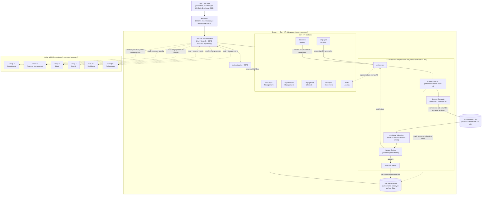
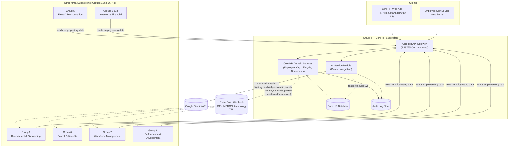
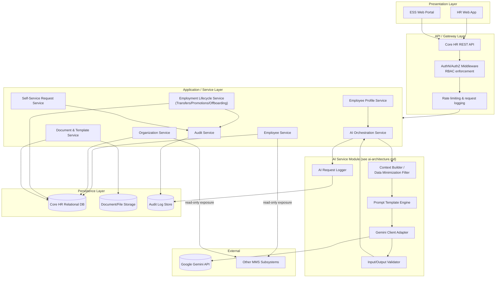
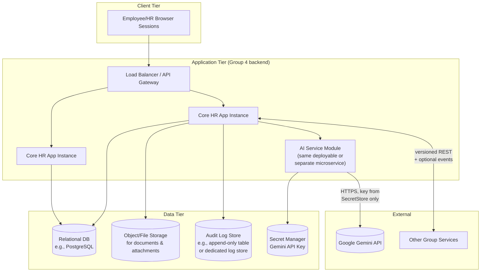
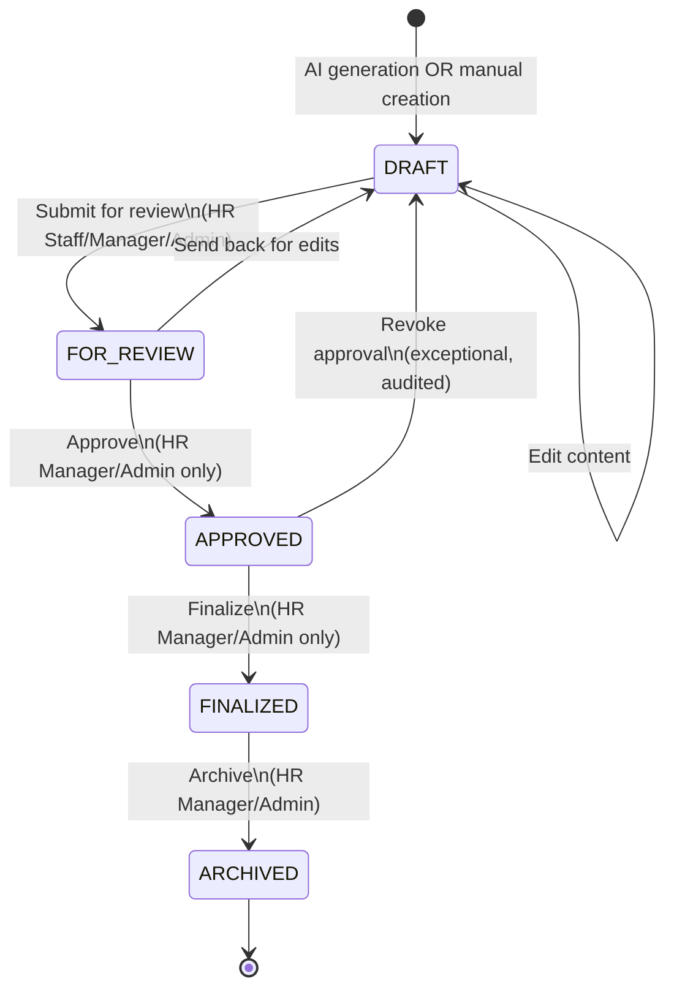

# Core HR (Group 4) — System Architecture

**Related documents:**
[`requirements.md`](./requirements.md) ·
[`ai-architecture.md`](./ai-architecture.md) ·
[`database-design.md`](./database-design.md) ·
[`integration-contract.md`](./integration-contract.md)

**Status:** Draft. Deployment topology, hosting, and infra choices are marked
`ASSUMPTION` where not yet confirmed by the client/infra team.

---

## 1. Architectural Principles

1. **Core HR is the single source of truth** for employee master data and
   organizational structure across the entire Microfinancial Management System (MMS).
   No other group persists its own copy of these facts; they either call Core HR's
   APIs at read time or consume published domain events.
2. **AI is assistive, never authoritative.** The AI Service can only produce `DRAFT`
   artifacts. It has no write access to authoritative tables and no capability to
   invoke approval, finalize, or transmit actions.
3. **Clear module boundaries.** Core HR is decomposed into cohesive modules (see
   `requirements.md` §9) that map to bounded contexts, each with its own data
   ownership within the Core HR database.
4. **Defense in depth for sensitive data.** RBAC, data minimization, and audit logging
   are layered, not relied upon individually.
5. **Loose coupling with other groups.** Integration happens through versioned APIs
   and/or asynchronous domain events, never direct cross-group database access.
6. **Provider abstraction.** The Gemini integration sits behind an internal `AIProvider`
   interface so the concrete LLM vendor/SDK can change without impacting business logic.

---

## 2. Complete System-Level Architecture Diagram

This is the consolidated, system-level view of Group 4 — Core HR requested for
onboarding new contributors and for client walkthroughs. It shows, in one diagram: the
user-to-module request path, the internal Core HR module breakdown, the full
Gemini-assisted AI pipeline (from context building through mandatory human review), the
Core HR database and which data it owns, and the integration boundary with the other
MMS subsystem groups. More detailed diagrams for each of these areas (layered
architecture, deployment, AI internals, ER model) follow in the sections after this one
and in the companion documents.

### 2.1 Reading the diagram

- **Request path (top-down, as specified):** `User/HR Staff → Frontend → Core HR
  Backend/API → {Employee Management, Organization Management, Employment Lifecycle,
  Employee Documents, Employee Profiling, Document Drafting, Audit Logging,
  Authentication/RBAC}`. The API is the single entry point and fans out to all eight
  modules (the `Core HR Modules` box groups the first seven for readability; every
  module inside it is reached directly from the API exactly as listed). `Authentication
  / RBAC` (`M8`) is drawn separately with a dotted "enforces RBAC on" edge into that
  group because it is a cross-cutting gate in front of every other module's actions,
  not a downstream data consumer like the rest — in the request pipeline it is
  evaluated *before* a request reaches any of the other seven modules.
- **Database access:** the `Core HR Modules` group has a single (aggregated) edge into
  the `Core HR Database` representing that `Employee Management`, `Organization
  Management`, `Employment Lifecycle`, `Employee Documents`, and `Audit Logging` each
  read/write their respective tables there directly; `Employee Profiling` and `Document
  Drafting` reach the database only indirectly, through the AI pipeline's `Context
  Builder` (read) and `Approved Result` (write) steps described next.
- **AI pipeline (as specified):** `Core HR (Employee Profiling / Document Drafting
  modules) → AI Service → Context Builder → Prompt Template → Gemini API → AI Output
  Validation → Human Review → Approved Result`. Only `Employee Profiling` and
  `Document Drafting` ever trigger this pipeline; every other module has no path into
  it. `Human Review` is the only node with the authority to produce an `Approved
  Result`; a reject/edit decision loops back to `AI Service` rather than reaching
  `Approved Result`, so there is no path from `Gemini API` to `Approved Result` that
  skips a human. `Approved Result` is what gets persisted back to the `Core HR
  Database` as the official `EmployeeProfile`/`HRDocument` record.
- **Database ownership:** a single `Core HR Database` is shown; §2.2 below identifies
  exactly which data in it Core HR owns as the authoritative source, versus data
  explicitly excluded/owned elsewhere.
- **Integration boundaries:** the dashed box labeled `Group 4 — Core HR Subsystem
  (system boundary)` marks what Group 4 owns and controls; the separate `Other MMS
  Subsystems (integration boundary)` box groups Groups 2, 3, 5, 6, 7, and 8. Every
  arrow crossing between the two boundaries goes through the `Core HR Backend / API`
  node and is drawn as a dash-dot line labeled with its direction/nature (read-only
  query, change event, or the one narrow write exception for Group 2 creating an
  employee on hire) — no other group has a solid (direct/internal) connection into Core
  HR's modules, database, or AI pipeline. Full per-group contract detail (exact
  endpoints and event payloads) is in [`integration-contract.md`](./integration-contract.md).

### 2.2 Database data ownership

| Data category (stored in the Core HR Database) | Owned by Core HR? | Notes |
|---|---|---|
| Employee master data (identity, personal info, contact info, emergency contacts) | ✅ Yes — authoritative | Sole source of truth; see `database-design.md` §3.1 |
| Employment info (status, department, position, branch, manager) | ✅ Yes — authoritative | |
| Organizational structure (departments, positions, branches, reporting lines) | ✅ Yes — authoritative | |
| Employment history ledger (hires, transfers, promotions, separations) | ✅ Yes — authoritative | Append-only |
| Employee documents metadata (IDs, contracts, certificates) | ✅ Yes — authoritative | File bytes may live in separate object storage; Core HR owns the metadata/ownership record |
| Document templates | ✅ Yes — authoritative | |
| Generated `HRDocument` drafts/approved documents + draft history | ✅ Yes — authoritative | |
| Generated `EmployeeProfile` records (source data + AI narrative) | ✅ Yes — authoritative | |
| `AIRequestLog` (AI generation metadata) | ✅ Yes — authoritative | Metadata only, not raw prompts (see `ai-architecture.md` §7) |
| `HRAuditLog` (HR + AI audit trail) | ✅ Yes — authoritative | |
| User accounts, roles, permissions (for Core HR access) | ✅ Yes — authoritative | Scoped to Core HR's own RBAC; a platform-wide identity provider, if one exists, is `ASSUMPTION`-flagged as out of scope here |
| Payroll figures, salary, bank/financial account details | ❌ No | Owned by **Group 6 — Payroll & Benefits**; never stored in or duplicated into Core HR |
| Attendance, shift schedules, timesheets, leave balances | ❌ No | Owned by **Group 7 — Workforce Management** |
| Performance ratings, competency scores, succession plans | ❌ No | Owned by **Group 8 — Performance & Development** |
| Applicant/candidate data prior to hire, job requisitions | ❌ No | Owned by **Group 2 — Recruitment & Onboarding** (Core HR only receives the resulting employee record at hire time, per §2.3 of `integration-contract.md`) |
| Vehicle/trip/fleet records | ❌ No | Owned by **Group 5 — Fleet & Transportation Management** |
| General ledger, disbursements, financial transactions | ❌ No | Owned by **Group 3 — Financial Management System** |
| Inventory/procurement records | ❌ No | Owned by **Group 1 — Supply Chain & Inventory Management** (not shown in the diagram above per the requested scope, but excluded on the same basis) |

This table is the practical, data-level expression of the architectural principle in
§1: Core HR owns identity/org/employment/document/profile/audit data outright, and
explicitly does not duplicate data that another group already owns as its source of
truth.

---

## 3. High-Level System Context

`ASSUMPTION`: The exact event-bus technology (message broker vs. webhook callbacks vs.
polling) is not yet specified by the client/infra team. Both a synchronous API and an
asynchronous event option are described in `integration-contract.md` so the final
choice can be made without redesigning the domain model.

---

## 4. Layered Architecture (within Group 4)

---

## 5. Module Responsibilities

| Layer | Module | Responsibility | Talks to |
|---|---|---|---|
| Application | **Employee Service** | CRUD for employee master/personal/contact/emergency data; enforces field-level RBAC. | Core HR DB, Audit Service |
| Application | **Organization Service** | Departments, positions, branches, reporting hierarchy. | Core HR DB, Audit Service |
| Application | **Employment Lifecycle Service** | Transfers, promotions, resignation/termination workflows; append-only employment history ledger; status-change approvals. | Core HR DB, Audit Service, publishes domain events |
| Application | **Document & Template Service** | Employee document uploads (metadata + storage pointer); HR document templates; generated document lifecycle state machine. | Core HR DB, Document/File Storage, AI Orchestration Service, Audit Service |
| Application | **Employee Profile Service** | Orchestrates AI profile generation requests, review, versioning of approved profiles. | AI Orchestration Service, Core HR DB, Audit Service |
| Application | **Self-Service Request Service** | Employee-submitted change requests and their HR approval workflow. | Core HR DB, Audit Service |
| Application | **Audit Service** | Central append-only writer/reader for the HR audit trail. | Audit Log Store |
| Application | **AI Orchestration Service** | Coordinates a generation request end-to-end: fetch approved data → hand off to AI Service Module → receive validated draft → persist as `DRAFT`. Never itself calls approval/finalize logic. | AI Service Module, Document & Template Service, Employee Profile Service |
| AI Module | **Context Builder / Data Minimization Filter** | Applies per-task field allow-lists; strips/masks excluded fields (see `ai-architecture.md` §6). | Called by AI Orchestration Service |
| AI Module | **Prompt Template Engine** | Renders versioned prompt templates with minimized context. | Context Builder |
| AI Module | **Gemini Client Adapter** | Sole component with Gemini API credentials; performs the actual API call, applies retries/timeouts. | Google Gemini API |
| AI Module | **Input/Output Validator** | Pre-call input validation; post-call schema + fact-grounding validation. | Gemini Client Adapter |
| AI Module | **AI Request Logger** | Writes privacy-aware metadata records of each AI call to the audit store (not raw sensitive content). | Audit Log Store |

---

## 6. API Boundaries

Core HR exposes a single **versioned REST API** (`/api/core-hr/v1/...`) as the only
sanctioned entry point into its data and functions. Internal service-to-service calls
within Group 4 may use direct in-process calls or an internal RPC, but that is an
implementation detail invisible to other groups.

### 6.1 API surface groups

| Surface | Audience | Examples |
|---|---|---|
| **HR Management API** | Group 4's own HR Web App | Full CRUD on employees, org structure, lifecycle events, templates, documents, profiles. Protected by RBAC per `requirements.md` §6.1. |
| **Employee Self-Service API** | Group 4's own ESS Portal | Read own record; submit self-service change requests. Enforces "self only" row-level security. |
| **AI Generation API** | Group 4's own HR Web App (never called directly by frontend to Gemini) | `POST /ai/employee-profile/generate`, `POST /ai/documents/generate`, review/approve endpoints. |
| **Cross-Group Integration API** | Other MMS subsystems (Groups 1,2,3,5,6,7,8) | Read-mostly employee/org endpoints + optional domain events. Detailed contract in [`integration-contract.md`](./integration-contract.md). |
| **Admin/Audit API** | HR Admin, System Admin | Role/permission management, audit trail query. |

### 6.2 API boundary rules

- All authoritative **writes** to employee/org/employment data happen only inside
  Group 4's own services, triggered only by Group 4's own UI (HR Web App / ESS Portal)
  or well-defined internal workflows (e.g., approval transitions). No external group is
  ever granted write access to Core HR data.
- Other groups integrate **read-only** against the Cross-Group Integration API (or
  subscribe to domain events for change notifications) — see
  [`integration-contract.md`](./integration-contract.md) for exact endpoints/events.
  If another group needs to *request* a Core HR change (e.g., Payroll flags a status
  discrepancy), that is modeled as a request/notification back to Core HR, not a direct
  write.
- The **AI Generation API** is only reachable by authenticated Group 4 HR users through
  the Group 4 backend; the Gemini API itself is never reachable from any frontend, and
  never reachable by other groups at all.
- All API responses use consistent envelope, pagination, and error formats
  (`ASSUMPTION`: exact envelope/error schema to be aligned with the MMS-wide API
  standard, if one exists at the program level — not yet supplied).

---

## 7. Deployment View (indicative)

`ASSUMPTION`: Whether the AI Service Module is deployed as a separable microservice or
as an in-process module of the same Core HR backend is an infrastructure decision, not
a domain-modeling one; the logical boundary (module) is fixed regardless, so this can
change later without affecting the design in this document set.

---

## 8. Cross-Cutting Concerns

### 8.1 Security
- RBAC enforced at the API Gateway/middleware layer on every request (see
  `requirements.md` §4.5, §6.1).
- Row-level scoping for ESS users (self-record only) and, if confirmed, branch/
  department scoping for HR Manager (see `requirements.md` Assumption A2).
- Gemini API key and any other AI-provider credentials live only in a server-side
  secret store; the AI Service Module is the only component with runtime access to it.
- All inter-service and external calls use TLS.

### 8.2 Auditability
A single **Audit Service** is the only writer to the Audit Log Store. Every mutating
domain action (CRUD on employee/org/lifecycle data, template changes, document status
transitions) and every AI action (generation request, validation outcome, human review
decision) is emitted as a structured audit event. See §21-equivalent detail in
[`ai-architecture.md`](./ai-architecture.md) §7 for AI-specific redaction rules and
[`database-design.md`](./database-design.md) §5 for the audit log schema.

### 8.3 Extensibility
- New document types are added by publishing a new `DocumentTemplate` (data), not by
  code changes, as long as they fit the existing template/field-merge model.
- New AI tasks (e.g., a future "exit interview summary") plug into the same AI Service
  Module by adding a new prompt template + allow-list entry, reusing the same
  validation/audit/human-review pipeline.
- New consumer groups integrate against the existing Cross-Group Integration API
  surface; contract versioning (see `integration-contract.md` §1) allows additive
  changes without breaking existing consumers.

### 8.4 Failure isolation
- Core HR's non-AI functionality (CRUD, lifecycle workflows, ESS) has **no runtime
  dependency** on the Gemini API being available. AI features degrade independently.
- The AI Service Module applies timeouts, retries with backoff, and (recommended) a
  circuit breaker so repeated Gemini failures don't degrade the rest of the platform
  (see `ai-architecture.md` §2.5).

---

## 9. Document Lifecycle (Architectural View)

The document lifecycle state machine is owned by the **Document & Template Service**
and is identical regardless of whether the document was AI-drafted or manually created
(manually-created documents simply skip the "AI generation" trigger and start directly
in `DRAFT`, authored by a human).

Full field-level detail (who can trigger each transition, what gets logged, what data
is required) is in [`ai-architecture.md`](./ai-architecture.md) §4.3 and
[`database-design.md`](./database-design.md) entity `HRDocument`.

---

## 10. Integration Points Summary

Detailed request/response contracts, event payloads, and versioning policy are in
[`integration-contract.md`](./integration-contract.md). Summary of *why* each group
integrates with Core HR:

| Group | Needs from Core HR | Direction |
|---|---|---|
| 1 — Supply Chain & Inventory | Employee identity for accountability on inventory transactions (e.g., "issued by", "received by") `(ASSUMPTION: exact use case unconfirmed)` | Core HR → Group 1 (read) |
| 2 — Recruitment & Onboarding | Create/link a Core HR employee master record once a candidate is hired; org structure (departments/positions) to place new hires into | Group 2 → Core HR (create-on-hire callback) + Core HR → Group 2 (read org structure) |
| 3 — Financial Management | Employee identity for expense/disbursement approval chains `(ASSUMPTION)` | Core HR → Group 3 (read) |
| 5 — Fleet & Transportation | Employee/driver identity, department/branch for vehicle assignment and accountability | Core HR → Group 5 (read) |
| 6 — Payroll & Benefits | Employee master data, employment status, position/department, employment history (hire/termination dates) as the factual basis for pay computation and benefits eligibility | Core HR → Group 6 (read + change events) |
| 7 — Workforce Management | Employee master data, department/branch, employment status for scheduling/attendance/leave eligibility | Core HR → Group 7 (read + change events) |
| 8 — Performance & Development | Employee master data, position, department, employment history for performance review and succession planning context | Core HR → Group 8 (read + change events) |

---

*End of `architecture.md`. See [`ai-architecture.md`](./ai-architecture.md) for AI
subsystem internals and [`integration-contract.md`](./integration-contract.md) for
concrete API/event contracts.*
