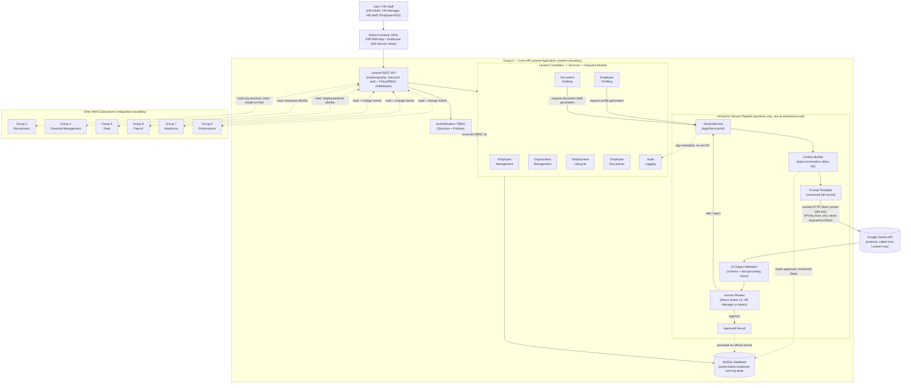
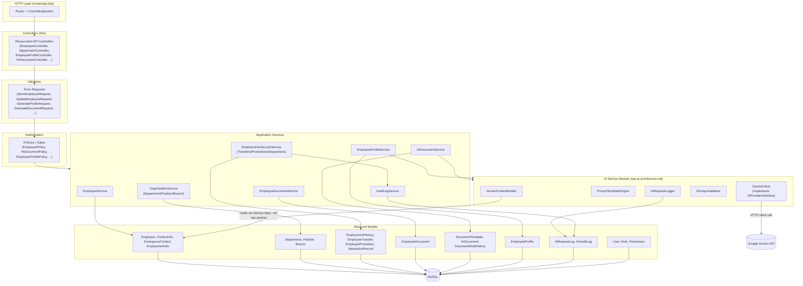
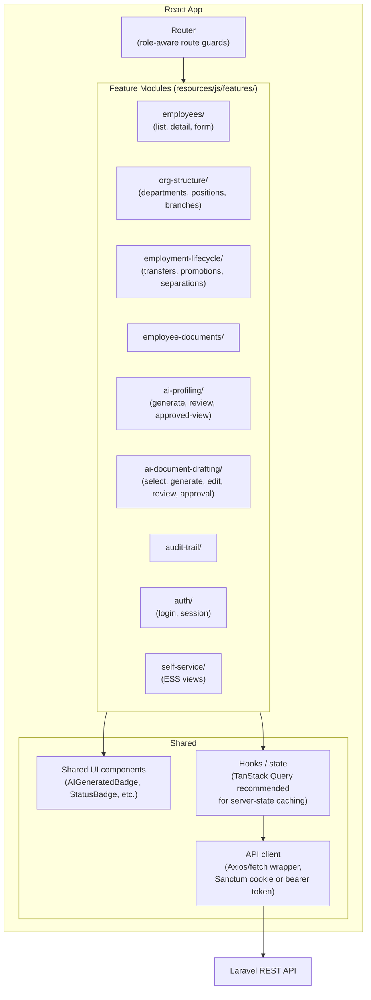
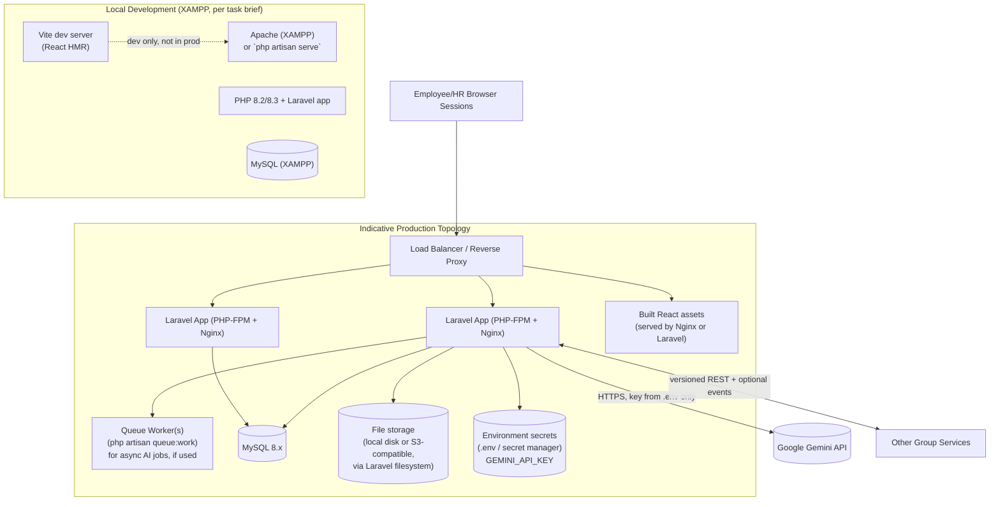
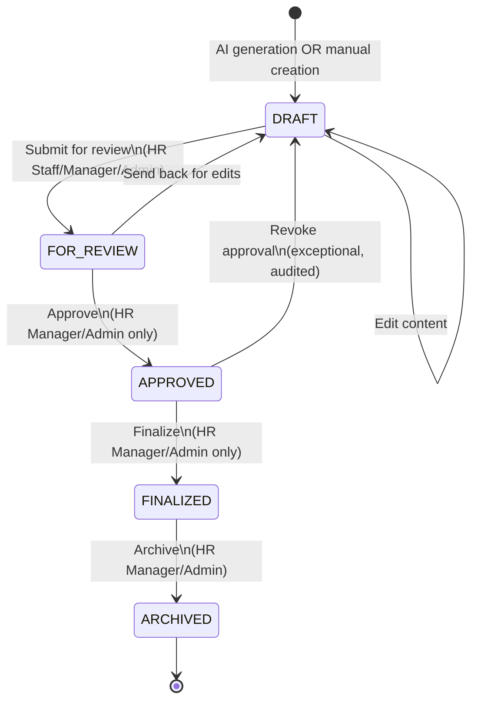

# Core HR (Group 4) — System Architecture (Laravel + React)

**Related documents:**
[`project-analysis.md`](./project-analysis.md) ·
[`requirements.md`](./requirements.md) ·
[`ai-architecture.md`](./ai-architecture.md) ·
[`database-design.md`](./database-design.md) ·
[`api-contract.md`](./api-contract.md) ·
[`integration-contract.md`](./integration-contract.md)

**Status:** Draft, green-field design (no existing Laravel/React project was found in
this repository — see [`project-analysis.md`](./project-analysis.md)). Technology
choices required by the task brief (Laravel, React, MySQL, Gemini) are treated as
fixed; choices not specified by the brief (exact Laravel/PHP version, auth package,
deployment topology) are marked `ASSUMPTION` and must be confirmed or reconciled with
any real base project the client ultimately provides.

---

## 1. Architectural Principles

1. **Core HR is the single source of truth** for employee master data and
   organizational structure across the entire Microfinancial Management System (MMS).
   No other group persists its own copy of these facts; they either call Core HR's
   Laravel REST API at read time or consume published domain events.
2. **AI is assistive, never authoritative.** The Gemini/AI service can only produce
   `draft` Eloquent records (`employee_profiles`, `hr_documents`). It has no
   permission to write to authoritative tables (`employees`, `employment_infos`,
   `employment_histories`, etc.) and no code path that invokes approval, finalize, or
   transmit actions.
3. **Clear module boundaries.** Core HR is decomposed into cohesive modules (see
   `requirements.md` §9) that map 1:1 to Laravel domains — a set of Eloquent models,
   a service class, one or more Form Requests, a Policy, and a resourceful controller
   per module.
4. **Defense in depth for sensitive data.** Laravel Sanctum authentication, Policy-based
   RBAC, Form Request validation, data minimization before any Gemini call, and audit
   logging are layered, not relied upon individually.
5. **Loose coupling with other groups.** Integration happens through the versioned
   Laravel REST API (`/api/core-hr/v1/...`) and/or asynchronous domain events, never
   direct cross-group database access — regardless of whether Core HR ends up
   deployed as its own Laravel application or as a module inside a shared monolith
   (see `project-analysis.md` §2.3, Assumption A0).
6. **Provider abstraction.** The Gemini integration sits behind an internal PHP
   interface (`App\Services\AI\Contracts\AIProviderInterface`, or similar) bound in the
   Laravel service container, so the concrete LLM vendor/SDK can change without
   impacting calling code.
7. **Framework-idiomatic by default.** Where the brief does not dictate a specific
   mechanism, this design follows standard Laravel conventions (Form Requests, API
   Resources, Policies, Eloquent relationships, migrations/factories/seeders) rather
   than inventing custom patterns, so the codebase is approachable to any Laravel
   developer joining the project.

---

## 2. Complete System-Level Architecture Diagram

This is the consolidated, system-level view of Group 4 — Core HR, grounded in the
Laravel + React stack. It shows the user-to-module request path through the Laravel
API, the internal Core HR module breakdown, the full Gemini-assisted AI pipeline (from
context building through mandatory human review), the MySQL database and which data it
owns, and the integration boundary with the other MMS subsystem groups.

### 2.1 Reading the diagram

- **Request path (top-down, as specified):** `React Frontend → Laravel REST API →
  Laravel Services (behind Controllers) → {Employee Management, Organization
  Management, Employment Lifecycle, Employee Documents, Employee Profiling, Document
  Drafting, Audit Logging}`, gated throughout by `Authentication / RBAC` (Sanctum +
  Policies), matching the brief's required flow `React → Laravel REST API → Laravel
  Services → MySQL`.
- **Database access:** the `Modules` group's Laravel services read/write MySQL through
  Eloquent models. `Employee Profiling` and `Document Drafting` reach the database only
  indirectly — through the AI pipeline's `Context Builder` (read) and `Approved Result`
  (write) steps — never by handing the model directly to Gemini.
- **AI pipeline (as specified):** `Core HR → AI/Gemini Service → Context Builder →
  Prompt Template → Gemini API → AI Output Validation → Human Review → Approved
  Result`, matching the brief's required AI flow `React → Laravel API → AI/Gemini
  Service → Google Gemini API → AI Output Validation → React Review Interface`. Only
  `Employee Profiling` and `Document Drafting` ever trigger this pipeline. `Human
  Review` (rendered in the React review UI) is the only step with authority to produce
  an `Approved Result`; a reject/edit decision loops back to `GeminiService` rather than
  reaching `Approved Result`.
- **Database ownership:** a single MySQL database is shown; §2.2 identifies exactly
  which tables/data Core HR owns as the authoritative source, versus data owned by
  other groups.
- **Integration boundaries:** the dashed `Group 4 — Core HR Laravel Application`
  boundary marks what Group 4 owns and controls; the `Other MMS Subsystems` boundary
  groups Groups 2, 3, 5, 6, 7, and 8. Every cross-boundary arrow passes through the
  Laravel REST API and is authenticated (Sanctum personal access tokens for
  service-to-service calls — see `api-contract.md` §3) — no other group has direct
  database access into Core HR's MySQL instance.

### 2.2 Database data ownership

| Data category (stored in Core HR's MySQL database) | Owned by Core HR? | Notes |
|---|---|---|
| Employee master data (identity, personal info, contact info, emergency contacts) | ✅ Yes — authoritative | Sole source of truth; see `database-design.md` §3 |
| Employment info (status, department, position, branch, manager) | ✅ Yes — authoritative | |
| Organizational structure (departments, positions, branches, reporting lines) | ✅ Yes — authoritative | |
| Employment history ledger (hires, transfers, promotions, separations) | ✅ Yes — authoritative | Append-only |
| Employee documents metadata (IDs, contracts, certificates) | ✅ Yes — authoritative | File bytes stored via Laravel's filesystem/storage abstraction; the `employee_documents` table owns the metadata/ownership record |
| Document templates | ✅ Yes — authoritative | |
| Generated `hr_documents` drafts/approved documents + draft history | ✅ Yes — authoritative | |
| Generated `employee_profiles` (source data + AI narrative) | ✅ Yes — authoritative | |
| `ai_request_logs` (AI generation metadata) | ✅ Yes — authoritative | Metadata only, not raw prompts (see `ai-architecture.md` §7) |
| `hr_audit_logs` (HR + AI audit trail) | ✅ Yes — authoritative | |
| `users`, roles, permissions (for Core HR access) | ✅ Yes — authoritative | Scoped to Core HR's own Sanctum-authenticated users; a platform-wide identity provider, if one exists across all 8 groups, is `ASSUMPTION`-flagged as out of scope here |
| Payroll figures, salary, bank/financial account details | ❌ No | Owned by **Group 6 — Payroll & Benefits**; never stored in or duplicated into Core HR's MySQL schema |
| Attendance, shift schedules, timesheets, leave balances | ❌ No | Owned by **Group 7 — Workforce Management** |
| Performance ratings, competency scores, succession plans | ❌ No | Owned by **Group 8 — Performance & Development** |
| Applicant/candidate data prior to hire, job requisitions | ❌ No | Owned by **Group 2 — Recruitment & Onboarding** (Core HR only receives the resulting employee record at hire time, per `integration-contract.md` §2.3) |
| Vehicle/trip/fleet records | ❌ No | Owned by **Group 5 — Fleet & Transportation Management** |
| General ledger, disbursements, financial transactions | ❌ No | Owned by **Group 3 — Financial Management System** |
| Inventory/procurement records | ❌ No | Owned by **Group 1 — Supply Chain & Inventory Management** |

---

## 3. Backend Layered Architecture (Laravel)

### 3.1 Layer responsibilities

| Layer | Laravel construct | Responsibility |
|---|---|---|
| HTTP | `routes/api.php`, route groups + middleware | Declares the versioned API surface (`/api/core-hr/v1/...`); applies `auth:sanctum` and Policy-backed authorization middleware. Full route list in `api-contract.md`. |
| Controllers | `App\Http\Controllers\Api\*` | Thin resourceful controllers: accept a validated Form Request, delegate to a Service, return an API Resource. No business logic in controllers. |
| Validation | `App\Http\Requests\*` (Form Requests) | All input validation lives here (`authorize()` for coarse-grained checks, `rules()` for field validation); this is the concrete mechanism behind `FR-EMP-16`. |
| Authorization | `App\Policies\*` (Laravel Policies), Gates | Row/action-level authorization (e.g., "can this user edit this employee", "can this user approve this document") — the concrete mechanism behind RBAC (`FR-SEC-*`). |
| Application Services | `App\Services\*` | Business logic and orchestration per module (see `requirements.md` §9); the only layer allowed to coordinate multiple Eloquent models/transactions for a single use case. |
| AI Service Module | `App\Services\AI\*` | Gemini integration internals — detailed in `ai-architecture.md` §2. Called only by `EmployeeProfileService` and `HrDocumentService`, never directly by controllers. |
| Eloquent Models | `App\Models\*` | Data access + relationships + casts (e.g., `EmploymentStatus` enum cast); full model list and schema in `database-design.md`. |
| Persistence | MySQL via Laravel migrations | Reproducible schema — see `database-design.md`. |

### 3.2 Authentication & authorization mechanics

- **Authentication:** Laravel Sanctum.
  - React SPA uses Sanctum's cookie-based SPA authentication (CSRF-protected session
    cookies) when served from a domain covered by Sanctum's `stateful` config.
  - Sanctum **personal access tokens** are issued for service-to-service calls from
    other MMS groups' backends against the Cross-Group Integration API (see
    `integration-contract.md` §2) and for any non-browser client.
  - `ASSUMPTION`: If the client's actual environment has an existing shared
    authentication/SSO mechanism across all 8 groups, Core HR's auth layer should be
    adapted to it instead of introducing a second, competing auth system — flagged
    here pending confirmation of the real base project (`project-analysis.md` §2.3
    Assumption A0).
- **Authorization:** Laravel Policies mapped 1:1 to Eloquent models that need
  record-level rules (`EmployeePolicy`, `HrDocumentPolicy`, `EmployeeProfilePolicy`,
  `DocumentTemplatePolicy`), plus named Gates for coarse-grained, non-model-specific
  permissions (e.g., `Gate::allows('ai.profile.generate')`,
  `Gate::allows('ai.document.approve')`). Role → permission mapping is data-driven
  (stored in `roles`/`permissions`/`role_permission` tables, not hardcoded switch
  statements), so it can be administered without a deployment — see
  `database-design.md` §3.7.

---

## 4. Frontend Structure (React)

Since no existing frontend was found, this is a proposed structure for a feature-first
React SPA (see `project-analysis.md` §2.1/§3.3 for the "not found" finding and
recommended defaults: React 18+, Vite, TypeScript).

Key React-side design points:

- **No Gemini calls from React, ever.** `ai-profiling/` and `ai-document-drafting/`
  feature modules only ever call Laravel endpoints (`/api/core-hr/v1/ai/...`); the
  Gemini API key never reaches the browser bundle, browser network tab, or any
  client-side environment variable (`VITE_*` variables are publicly readable, so the
  key must never be assigned to one).
- **Explicit "AI-generated, pending review" UI treatment** on every screen that shows
  Gemini output, satisfying `NFR-USE-01`.
- **Role-aware routing/guards**, mirroring the backend Policies, so UI affordances
  (e.g., an "Approve" button) are only rendered for roles that also pass the backend
  check — the backend Policy remains the actual security boundary; the frontend guard
  is a UX convenience, not a security control.
- `ASSUMPTION`: Whether the React app is served from Laravel's own `resources/js`
  (single-deployable, Sanctum SPA cookie auth) or as a fully separate SPA deployment
  (cross-origin, Sanctum token auth) is undetermined absent a real base project;
  `api-contract.md` §3 documents both auth modes so either can be adopted without
  changing the API contract itself.

---

## 5. Module Responsibilities (Laravel mapping)

| Module | Laravel Service | Key Eloquent Models | Talks to |
|---|---|---|---|
| Employee Management | `EmployeeService` | `Employee`, `ContactInfo`, `EmergencyContact` | MySQL, `AuditLogService` |
| Organization Management | `OrganizationService` | `Department`, `Position`, `Branch` | MySQL, `AuditLogService` |
| Employment Lifecycle | `EmploymentLifecycleService` | `EmploymentInfo`, `EmploymentHistory`, `EmployeeTransfer`, `EmployeePromotion`, `SeparationRecord` | MySQL, `AuditLogService`, publishes domain events |
| Employee Documents | `EmployeeDocumentService` | `EmployeeDocument` | MySQL, Laravel filesystem/storage, `AuditLogService` |
| Employee Profiling | `EmployeeProfileService` | `EmployeeProfile` | AI Service Module, MySQL, `AuditLogService` |
| Document Drafting | `HrDocumentService` | `DocumentTemplate`, `HrDocument`, `DocumentDraftHistory` | AI Service Module, MySQL, `AuditLogService` |
| Audit Logging | `AuditLogService` | `HrAuditLog` | MySQL |
| Authentication / RBAC | Sanctum + `App\Policies\*` | `User`, `Role`, `Permission` | MySQL |
| AI/Gemini Service (shared) | `GeminiService` + `App\Services\AI\*` | `AiRequestLog` (writes); reads other models via the calling Service, never directly | Google Gemini API (via Laravel HTTP client), `AuditLogService` |

Full per-service method-level responsibilities and the AI pipeline internals are in
[`ai-architecture.md`](./ai-architecture.md); route-level detail is in
[`api-contract.md`](./api-contract.md).

---

## 6. Minimal Package List (proposed)

Per the task instruction not to install unnecessary packages, this is the minimal set
this design anticipates needing — no packages have been installed as part of this
analysis phase.

| Package | Purpose | Necessity |
|---|---|---|
| `laravel/sanctum` | Authentication (SPA session + API tokens) | Laravel's documented first-party choice for this exact use case; no simpler built-in alternative |
| *(no extra HTTP client package)* | Gemini API calls | Laravel's built-in `Illuminate\Support\Facades\Http` (Guzzle under the hood, already a Laravel dependency) is sufficient — no separate Gemini SDK is required |
| `laravel/pint` (dev only) | Code style (PSR-12) | Ships with Laravel; zero-config |
| `laravel/pail` or built-in logging (dev only) | Local log tailing | Optional convenience, not a hard requirement |
| React, `react-dom` | Frontend framework | Required by the brief |
| `vite`, `@vitejs/plugin-react` | Frontend build tooling | Laravel's default modern frontend build path |
| `axios` (or native `fetch`) | HTTP client for React → Laravel calls | `ASSUMPTION`: either is acceptable; `axios` is the more common Laravel+React pairing for interceptor-based auth header handling |
| `@tanstack/react-query` (optional) | Server-state caching/loading states for async AI generation calls | `ASSUMPTION`: recommended, not mandated — simplifies the "long-running AI request" UX (`NFR-PERF-02`) but a hand-rolled loading-state solution is also acceptable |

Explicitly **not** proposed: a dedicated Gemini PHP SDK package (unnecessary — the
Gemini REST API is called directly via Laravel's HTTP client per `ai-architecture.md`
§2), Laravel Passport (OAuth2 is not needed for this use case), a queue-specific
package beyond Laravel's built-in queue system (if async job dispatch is used for AI
generation — see `ai-architecture.md` §2.6).

---

## 7. Deployment View (indicative)

`ASSUMPTION`: The task brief specifies **XAMPP for local development only**; the
production topology above is indicative (standard Laravel deployment pattern) and is
not dictated by the brief — actual production hosting, containerization, and CI/CD are
outside this analysis phase and should be confirmed with the client/infra team before
implementation.

---

## 8. Cross-Cutting Concerns

### 8.1 Security
- Sanctum-based authentication on every API route except public health checks;
  Policy/Gate-based authorization on every state-changing action (see §3.2).
- Form Requests validate and sanitize all incoming data before it reaches a Service
  (`FR-EMP-16`); mass-assignment protection via Eloquent `$fillable`/`$guarded`.
- Gemini API key lives only in `.env` → `config/services.php`; only
  `App\Services\AI\GeminiClient` reads it at runtime. It is never returned in any API
  response, never logged, and never present in any React build artifact.
- All traffic (browser ↔ Laravel, Laravel ↔ Gemini, Laravel ↔ other groups) uses TLS
  in any non-local environment.

### 8.2 Auditability
A single `AuditLogService` is the only writer to `hr_audit_logs`. Every mutating
domain action (CRUD on employee/org/lifecycle data, template changes, document status
transitions) and every AI action (generation request, validation outcome, human review
decision) is emitted as a structured audit event, typically via a Laravel **Model
Observer** (e.g., `EmployeeObserver`, `HrDocumentObserver`) or explicit service-layer
calls for actions that aren't simple model events (e.g., approval transitions). See
[`ai-architecture.md`](./ai-architecture.md) §7 for AI-specific redaction rules and
[`database-design.md`](./database-design.md) §5 for the audit log schema.

### 8.3 Extensibility
- New document types are added by publishing a new `DocumentTemplate` (data), not by
  code changes, as long as they fit the existing template/field-merge model.
- New AI tasks (e.g., a future "exit interview summary") plug into the same AI Service
  Module by adding a new prompt template row + allow-list config entry, reusing the
  same validation/audit/human-review pipeline and the same `AIProviderInterface`.
- New consumer groups integrate against the existing Cross-Group Integration API
  surface; Laravel API versioning (URL-prefixed `v1`, `v2`, ...) allows additive
  changes without breaking existing consumers — see `integration-contract.md` §6.

### 8.4 Failure isolation
- Core HR's non-AI functionality (CRUD, lifecycle workflows, ESS) has **no runtime
  dependency** on the Gemini API being available. AI features degrade independently.
- `GeminiClient` applies timeouts, retry with backoff (Laravel HTTP client's built-in
  `retry()`), and a circuit-breaker pattern (`ASSUMPTION`: implemented via a simple
  cache-backed failure counter, no extra package required) so repeated Gemini failures
  don't degrade the rest of the platform — see `ai-architecture.md` §2.5.

---

## 9. Document Lifecycle (Architectural View)

The document lifecycle state machine is owned by `HrDocumentService` and enforced via
an `hr_documents.status` enum column plus a Laravel **Policy** that authorizes each
transition. It is identical regardless of whether the document was AI-drafted or
manually created (manually-created documents simply skip the AI generation trigger and
start directly in `draft`, authored by a human).

Full field-level detail (who can trigger each transition, what gets logged, what data
is required) is in [`ai-architecture.md`](./ai-architecture.md) §4.3 and
[`database-design.md`](./database-design.md) entity `hr_documents`; the concrete
Laravel endpoints for each transition are in [`api-contract.md`](./api-contract.md) §7.

---

## 10. Integration Points Summary

Detailed request/response contracts, event payloads, and versioning policy are in
[`integration-contract.md`](./integration-contract.md). Summary of *why* each group
integrates with Core HR:

| Group | Needs from Core HR | Direction |
|---|---|---|
| 1 — Supply Chain & Inventory | Employee identity for accountability on inventory transactions (e.g., "issued by", "received by") `(ASSUMPTION: exact use case unconfirmed)` | Core HR → Group 1 (read) |
| 2 — Recruitment & Onboarding | Create/link a Core HR employee master record once a candidate is hired; org structure (departments/positions) to place new hires into | Group 2 → Core HR (create-on-hire callback) + Core HR → Group 2 (read org structure) |
| 3 — Financial Management | Employee identity for expense/disbursement approval chains `(ASSUMPTION)` | Core HR → Group 3 (read) |
| 5 — Fleet & Transportation | Employee/driver identity, department/branch for vehicle assignment and accountability | Core HR → Group 5 (read) |
| 6 — Payroll & Benefits | Employee master data, employment status, position/department, employment history (hire/termination dates) as the factual basis for pay computation and benefits eligibility | Core HR → Group 6 (read + change events) |
| 7 — Workforce Management | Employee master data, department/branch, employment status for scheduling/attendance/leave eligibility | Core HR → Group 7 (read + change events) |
| 8 — Performance & Development | Employee master data, position, department, employment history for performance review and succession planning context | Core HR → Group 8 (read + change events) |

---

*End of `architecture.md`. See [`ai-architecture.md`](./ai-architecture.md) for AI
subsystem internals, [`database-design.md`](./database-design.md) for the migration
plan, [`api-contract.md`](./api-contract.md) for the concrete route table, and
[`integration-contract.md`](./integration-contract.md) for cross-group API/event
contracts.*
