# Core HR (Group 4) — Database Design (Laravel Migrations + Eloquent)

Logical and Laravel-concrete data model for the Core HR subsystem: migrations,
Eloquent models, relationships, and MySQL-specific notes. Per the task brief, the
schema must be **reproducible entirely through Laravel migrations, Eloquent models,
factories, and seeders** — no schema object is to be created by hand through
phpMyAdmin.

**Related documents:**
[`requirements.md`](./requirements.md) ·
[`architecture.md`](./architecture.md) ·
[`ai-architecture.md`](./ai-architecture.md) ·
[`api-contract.md`](./api-contract.md) ·
[`integration-contract.md`](./integration-contract.md)

**Status:** Design only — no migrations, models, factories, or seeders have been
created as part of this analysis phase (per the task instruction not to modify
application code yet). Table/column names below use Laravel's standard `snake_case`
convention so they can be implemented as-is.

---

## 1. Migration Plan Overview

Proposed migration order (respecting foreign key dependencies), one migration file
per table, following Laravel's default `database/migrations/` naming convention
(`yyyy_mm_dd_hhmmss_create_<table>_table.php`):

| # | Table | Depends on |
|---|---|---|
| 1 | `users` | — |
| 2 | `roles` | — |
| 3 | `permissions` | — |
| 4 | `role_permission` (pivot) | `roles`, `permissions` |
| 5 | `role_user` (pivot) | `roles`, `users` |
| 6 | `branches` | — |
| 7 | `departments` | `branches`, `departments` (self, `parent_department_id`) |
| 8 | `positions` | `departments` |
| 9 | `employees` | `positions`, `departments`, `branches`, `employees` (self, `manager_employee_id`) |
| 10 | `contact_infos` | `employees` |
| 11 | `emergency_contacts` | `employees` |
| 12 | `employment_infos` | `employees`, `departments`, `positions`, `branches`, `users` |
| 13 | `employment_histories` | `employees`, `users` |
| 14 | `employee_transfers` | `employees`, `departments`, `branches`, `users` |
| 15 | `employee_promotions` | `employees`, `positions`, `users` |
| 16 | `separation_records` | `employees`, `users` |
| 17 | `employee_documents` | `employees`, `users` |
| 18 | `self_service_update_requests` | `employees`, `users` |
| 19 | `document_templates` | `users` |
| 20 | `prompt_templates` | `users` |
| 21 | `hr_documents` | `employees`, `document_templates`, `users` |
| 22 | `document_draft_history` | `hr_documents`, `users` |
| 23 | `ai_request_logs` | `employees`, `users`, `prompt_templates` |
| 24 | `employee_profiles` | `employees`, `ai_request_logs`, `users` |
| 25 | `hr_audit_logs` | `users`, `employees`, `hr_documents`, `employee_profiles`, `ai_request_logs` |

Each table also gets Laravel's default `id()` (unsigned big integer primary key),
`timestamps()` (`created_at`/`updated_at`), and, where noted, `softDeletes()`
(`deleted_at`) for tables where soft-delete is preferable to hard delete (org
structure tables, so historical foreign keys remain valid).

`ASSUMPTION`: Primary keys are assumed to be Laravel's default auto-incrementing
`bigInteger` (`$table->id()`), not UUIDs. If cross-group integration requires
non-guessable or globally-unique identifiers exposed externally, a `uuid` column
(indexed, unique) can be added alongside the internal auto-increment PK without
changing this design — the public `integration-contract.md` API would expose the UUID,
internal joins would still use the integer PK. This is called out because it is a
common point of disagreement between teams and should be confirmed early.

---

## 2. Entity-Relationship Diagram

```mermaid
erDiagram
    EMPLOYEES ||--o| CONTACT_INFOS : has
    EMPLOYEES ||--o{ EMERGENCY_CONTACTS : has
    EMPLOYEES ||--|| EMPLOYMENT_INFOS : has
    EMPLOYEES ||--o{ EMPLOYMENT_HISTORIES : "generates events"
    EMPLOYEES ||--o{ EMPLOYEE_TRANSFERS : "subject of"
    EMPLOYEES ||--o{ EMPLOYEE_PROMOTIONS : "subject of"
    EMPLOYEES ||--o| SEPARATION_RECORDS : "may have"
    EMPLOYEES ||--o{ EMPLOYEE_DOCUMENTS : owns
    EMPLOYEES ||--o{ SELF_SERVICE_UPDATE_REQUESTS : submits
    EMPLOYEES ||--o{ EMPLOYEE_PROFILES : "profiled as"
    EMPLOYEES ||--o{ HR_DOCUMENTS : "subject of"
    EMPLOYEES }o--|| DEPARTMENTS : "belongs to (current)"
    EMPLOYEES }o--|| POSITIONS : "holds (current)"
    EMPLOYEES }o--|| BRANCHES : "assigned to (current)"
    EMPLOYEES }o--o| EMPLOYEES : "reports to (manager)"

    DEPARTMENTS ||--o{ POSITIONS : contains
    DEPARTMENTS }o--o| DEPARTMENTS : "parent department"
    BRANCHES ||--o{ DEPARTMENTS : hosts

    EMPLOYMENT_INFOS }o--|| DEPARTMENTS : references
    EMPLOYMENT_INFOS }o--|| POSITIONS : references
    EMPLOYMENT_INFOS }o--|| BRANCHES : references

    EMPLOYEE_TRANSFERS }o--|| DEPARTMENTS : "from/to"
    EMPLOYEE_TRANSFERS }o--|| BRANCHES : "from/to"
    EMPLOYEE_PROMOTIONS }o--|| POSITIONS : "from/to"

    DOCUMENT_TEMPLATES ||--o{ HR_DOCUMENTS : "generated from"
    HR_DOCUMENTS ||--o{ DOCUMENT_DRAFT_HISTORY : "has history of"
    HR_DOCUMENTS ||--o| AI_REQUEST_LOGS : "generated via (optional)"
    EMPLOYEE_PROFILES ||--o| AI_REQUEST_LOGS : "generated via (optional)"
    PROMPT_TEMPLATES ||--o{ AI_REQUEST_LOGS : "used by"

    USERS ||--o{ EMPLOYEES : "may be linked to (ESS login)"
    USERS }o--o{ ROLES : "assigned via role_user"
    ROLES }o--o{ PERMISSIONS : "granted via role_permission"
    USERS ||--o{ HR_AUDIT_LOGS : performs
    USERS ||--o{ AI_REQUEST_LOGS : initiates

    EMPLOYEES ||--o{ HR_AUDIT_LOGS : "affected by"

    EMPLOYEES {
        bigint id PK
        string first_name
        string last_name
        date date_of_birth
        string gender
        string civil_status
        string nationality
        bigint position_id FK
        bigint department_id FK
        bigint branch_id FK
        bigint manager_employee_id FK
        string employment_status
        timestamp created_at
        timestamp updated_at
        timestamp deleted_at
    }

    CONTACT_INFOS {
        bigint id PK
        bigint employee_id FK
        string mobile_number
        string personal_email
        string work_email
        string current_address
        string permanent_address
    }

    EMERGENCY_CONTACTS {
        bigint id PK
        bigint employee_id FK
        string full_name
        string relationship
        string phone_number
        string address
    }

    EMPLOYMENT_INFOS {
        bigint id PK
        bigint employee_id FK
        date hire_date
        string employment_type
        string employment_status
        bigint department_id FK
        bigint position_id FK
        bigint branch_id FK
        bigint reporting_manager_id FK
        date probation_end_date
    }

    DEPARTMENTS {
        bigint id PK
        string name
        bigint parent_department_id FK
        bigint branch_id FK
        boolean is_active
        timestamp deleted_at
    }

    POSITIONS {
        bigint id PK
        string title
        bigint department_id FK
        string grade_level
        boolean is_active
        timestamp deleted_at
    }

    BRANCHES {
        bigint id PK
        string name
        string location_address
        boolean is_active
        timestamp deleted_at
    }

    EMPLOYMENT_HISTORIES {
        bigint id PK
        bigint employee_id FK
        string event_type
        date effective_date
        string reason_category
        bigint related_record_id
        string related_record_type
        bigint recorded_by_user_id FK
        timestamp created_at
    }

    EMPLOYEE_TRANSFERS {
        bigint id PK
        bigint employee_id FK
        bigint from_department_id FK
        bigint to_department_id FK
        bigint from_branch_id FK
        bigint to_branch_id FK
        date effective_date
        string reason
        string status
        bigint requested_by_user_id FK
        bigint approved_by_user_id FK
        timestamp requested_at
        timestamp decided_at
    }

    EMPLOYEE_PROMOTIONS {
        bigint id PK
        bigint employee_id FK
        bigint from_position_id FK
        bigint to_position_id FK
        date effective_date
        string justification
        string status
        bigint requested_by_user_id FK
        bigint approved_by_user_id FK
        timestamp requested_at
        timestamp decided_at
    }

    SEPARATION_RECORDS {
        bigint id PK
        bigint employee_id FK
        string separation_type
        date last_working_day
        string reason_category
        string clearance_status
        string status
        bigint requested_by_user_id FK
        bigint approved_by_user_id FK
        timestamp requested_at
        timestamp decided_at
    }

    EMPLOYEE_DOCUMENTS {
        bigint id PK
        bigint employee_id FK
        string document_type
        string file_path
        string disk
        timestamp uploaded_at
        bigint uploaded_by_user_id FK
    }

    SELF_SERVICE_UPDATE_REQUESTS {
        bigint id PK
        bigint employee_id FK
        string field_group
        json proposed_changes
        string status
        bigint reviewed_by_user_id FK
        timestamp submitted_at
        timestamp decided_at
    }

    EMPLOYEE_PROFILES {
        bigint id PK
        bigint employee_id FK
        int version
        string status
        json source_data_snapshot
        json ai_generated_sections
        bigint ai_request_log_id FK
        bigint reviewed_by_user_id FK
        timestamp generated_at
        timestamp approved_at
    }

    DOCUMENT_TEMPLATES {
        bigint id PK
        string document_type
        string name
        int version
        string status
        json field_schema
        text template_body
        bigint published_by_user_id FK
        timestamp published_at
    }

    PROMPT_TEMPLATES {
        bigint id PK
        string task_type
        string name
        int version
        string status
        text system_instructions
        text user_prompt_template
        int token_budget
        bigint published_by_user_id FK
        timestamp published_at
    }

    HR_DOCUMENTS {
        bigint id PK
        bigint employee_id FK
        bigint template_id FK
        string document_type
        string status
        text content
        bigint ai_request_log_id FK
        bigint created_by_user_id FK
        bigint approved_by_user_id FK
        bigint finalized_by_user_id FK
        timestamp created_at
        timestamp status_changed_at
    }

    DOCUMENT_DRAFT_HISTORY {
        bigint id PK
        bigint hr_document_id FK
        string action_type
        string from_status
        string to_status
        text content_snapshot
        bigint actor_user_id FK
        timestamp occurred_at
    }

    AI_REQUEST_LOGS {
        bigint id PK
        string ai_feature
        bigint employee_id FK
        bigint initiated_by_user_id FK
        bigint prompt_template_id FK
        int prompt_template_version
        string model_identifier
        string result_status
        json fields_included
        int input_token_count
        int output_token_count
        timestamp requested_at
        timestamp responded_at
    }

    HR_AUDIT_LOGS {
        bigint id PK
        bigint actor_user_id FK
        string action_type
        bigint affected_employee_id FK
        bigint affected_hr_document_id FK
        bigint affected_employee_profile_id FK
        bigint ai_request_log_id FK
        string ai_feature_used
        string prompt_template_ref
        string model_ref
        string result_status
        string approval_action
        timestamp occurred_at
    }

    USERS {
        bigint id PK
        string name
        string email
        string password
        bigint linked_employee_id FK
        boolean is_active
        timestamp created_at
    }

    ROLES {
        bigint id PK
        string name
        string slug
    }

    PERMISSIONS {
        bigint id PK
        string code
        string description
    }
```

> Note: Mermaid `erDiagram` does not render pivot tables as first-class entities in a
> single relation line beyond `}o--o{`; `role_user` and `role_permission` are the
> physical pivot tables implementing the `USERS }o--o{ ROLES` and
> `ROLES }o--o{ PERMISSIONS` many-to-many relationships shown above.

---

## 3. Eloquent Models & Relationships

### 3.1 Employee master & organization

| Model | Table | Key relationships (Eloquent) | Notes |
|---|---|---|---|
| `Employee` | `employees` | `hasOne(ContactInfo::class)`, `hasMany(EmergencyContact::class)`, `hasOne(EmploymentInfo::class)`, `hasMany(EmploymentHistory::class)`, `belongsTo(Department::class)`, `belongsTo(Position::class)`, `belongsTo(Branch::class)`, `belongsTo(Employee::class, 'manager_employee_id')` | Uses `SoftDeletes`. `employment_status` cast to a PHP backed `enum` (`EmploymentStatus::class`). |
| `ContactInfo` | `contact_infos` | `belongsTo(Employee::class)` | Tier 2 sensitivity (see `ai-architecture.md` §6.1) — excluded from AI context. |
| `EmergencyContact` | `emergency_contacts` | `belongsTo(Employee::class)` | Excluded from AI context. |
| `EmploymentInfo` | `employment_infos` | `belongsTo(Employee::class)`, `belongsTo(Department::class)`, `belongsTo(Position::class)`, `belongsTo(Branch::class)` | Could be merged into `Employee`; kept separate to isolate employment-specific fields from personal identity fields for cleaner Policy scoping. |
| `Department` | `departments` | `belongsTo(Department::class, 'parent_department_id')`, `hasMany(Department::class, 'parent_department_id')`, `hasMany(Position::class)`, `belongsTo(Branch::class)` | `SoftDeletes`. |
| `Position` | `positions` | `belongsTo(Department::class)` | `SoftDeletes`. |
| `Branch` | `branches` | `hasMany(Department::class)` | `SoftDeletes`. |

### 3.2 Employment lifecycle

| Model | Table | Key relationships | Notes |
|---|---|---|---|
| `EmploymentHistory` | `employment_histories` | `belongsTo(Employee::class)`, `belongsTo(User::class, 'recorded_by_user_id')`, polymorphic-style `related_record_id`/`related_record_type` pointing at the causing `EmployeeTransfer`/`EmployeePromotion`/`SeparationRecord` | Append-only: no `update()`/`delete()` route exposed; consider a model observer that prevents mutation after creation. |
| `EmployeeTransfer` | `employee_transfers` | `belongsTo(Employee::class)`, `belongsTo(Department::class, 'from_department_id')`, `belongsTo(Department::class, 'to_department_id')`, `belongsTo(Branch::class, 'from_branch_id')`, `belongsTo(Branch::class, 'to_branch_id')` | `status` cast to enum (`pending`/`approved`/`rejected`). |
| `EmployeePromotion` | `employee_promotions` | `belongsTo(Employee::class)`, `belongsTo(Position::class, 'from_position_id')`, `belongsTo(Position::class, 'to_position_id')` | Same workflow pattern as `EmployeeTransfer`. |
| `SeparationRecord` | `separation_records` | `belongsTo(Employee::class)` | `separation_type` enum (`resignation`/`termination`). |

### 3.3 Documents (non-AI) & Self-Service

| Model | Table | Key relationships | Notes |
|---|---|---|---|
| `EmployeeDocument` | `employee_documents` | `belongsTo(Employee::class)`, `belongsTo(User::class, 'uploaded_by_user_id')` | `file_path`/`disk` used with Laravel's `Storage` facade; file bytes never sent to the AI service. |
| `SelfServiceUpdateRequest` | `self_service_update_requests` | `belongsTo(Employee::class)`, `belongsTo(User::class, 'reviewed_by_user_id')` | `proposed_changes` cast to `array` (JSON column); applied to `ContactInfo`/`EmergencyContact` on approval. |

### 3.4 AI Profiling

| Model | Table | Key relationships | Notes |
|---|---|---|---|
| `EmployeeProfile` | `employee_profiles` | `belongsTo(Employee::class)`, `belongsTo(AiRequestLog::class)`, `belongsTo(User::class, 'reviewed_by_user_id')` | `source_data_snapshot` and `ai_generated_sections` cast to `array`/JSON. `status` enum: `draft_generated` → `approved`. |

### 3.5 HR Document Drafting

| Model | Table | Key relationships | Notes |
|---|---|---|---|
| `DocumentTemplate` | `document_templates` | `hasMany(HrDocument::class, 'template_id')`, `belongsTo(User::class, 'published_by_user_id')` | `field_schema` cast to `array`. Template lifecycle (`draft`/`approved`/`archived`) is distinct from, but analogous to, the document lifecycle. |
| `PromptTemplate` | `prompt_templates` | `hasMany(AiRequestLog::class)` | Drives `ai-architecture.md` §2.1/§5.4; versioned rows, not hardcoded strings, per `NFR-MAINT-02`. |
| `HrDocument` | `hr_documents` | `belongsTo(Employee::class)`, `belongsTo(DocumentTemplate::class, 'template_id')`, `belongsTo(AiRequestLog::class)`, `hasMany(DocumentDraftHistory::class)` | `status` cast to enum (`draft`/`for_review`/`approved`/`finalized`/`archived`) matching `architecture.md` §9. |
| `DocumentDraftHistory` | `document_draft_history` | `belongsTo(HrDocument::class)`, `belongsTo(User::class, 'actor_user_id')` | Append-only. |

### 3.6 AI Platform & Audit

| Model | Table | Key relationships | Notes |
|---|---|---|---|
| `AiRequestLog` | `ai_request_logs` | `belongsTo(Employee::class)`, `belongsTo(User::class, 'initiated_by_user_id')`, `belongsTo(PromptTemplate::class)` | Does **not** store raw prompt/response text (see `ai-architecture.md` §7.1); `fields_included` cast to `array`, stores field *names* only. |
| `HrAuditLog` | `hr_audit_logs` | `belongsTo(User::class, 'actor_user_id')`, `belongsTo(Employee::class, 'affected_employee_id')`, `belongsTo(HrDocument::class, 'affected_hr_document_id')`, `belongsTo(EmployeeProfile::class, 'affected_employee_profile_id')`, `belongsTo(AiRequestLog::class)` | Append-only, no `updated_at` needed (single `occurred_at` timestamp is sufficient). |

### 3.7 Security

| Model | Table | Key relationships | Notes |
|---|---|---|---|
| `User` | `users` | `belongsTo(Employee::class, 'linked_employee_id')`, `belongsToMany(Role::class)` via `role_user`, `HasApiTokens` trait (Sanctum) | System Administrators and some HR staff may have a `User` without a corresponding `Employee` linkage — `linked_employee_id` nullable. |
| `Role` | `roles` | `belongsToMany(User::class)`, `belongsToMany(Permission::class)` via `role_permission` | Seeded via a `RoleSeeder` with the five roles from `requirements.md` §6. |
| `Permission` | `permissions` | `belongsToMany(Role::class)` | Seeded via a `PermissionSeeder`; codes match the Gate/Policy permission strings referenced throughout `architecture.md`/`ai-architecture.md` (e.g., `ai.profile.generate`, `ai.document.approve`). |

---

## 4. Factories & Seeders (planned, not yet implemented)

Per the task brief's instruction to use Laravel factories and seeders (none created in
this analysis phase):

| Factory | Purpose |
|---|---|
| `EmployeeFactory` | Generates realistic fake employees for local development/testing (`fake()->name()`, etc.), with states like `->terminated()`, `->onProbation()` for testing lifecycle edge cases. |
| `DepartmentFactory`, `PositionFactory`, `BranchFactory` | Generate a small representative org structure for local dev. |
| `EmploymentHistoryFactory`, `EmployeeTransferFactory`, `EmployeePromotionFactory`, `SeparationRecordFactory` | Generate lifecycle event fixtures for testing workflows and approvals. |
| `DocumentTemplateFactory` | Seeds one template per document type listed in `requirements.md` §4.3 (`FR-DOC-11`) for local development, marked `approved` so generation can be tested end-to-end without a manual template-authoring step. |
| `PromptTemplateFactory` | Seeds the initial profiling + per-document-type prompt templates (version 1) referenced throughout `ai-architecture.md`. |
| `UserFactory` (Laravel default, extended) | Adds a `->withRole('hr_admin')` style state helper for test setup. |

| Seeder | Purpose |
|---|---|
| `RoleSeeder` | Creates the five roles from `requirements.md` §6 (HR Administrator, HR Manager, HR Staff, System Administrator, Employee). |
| `PermissionSeeder` | Creates the permission codes referenced by Policies/Gates across `architecture.md`/`ai-architecture.md`, and attaches them to roles per the permission matrix in `requirements.md` §6.1. |
| `DocumentTemplateSeeder` | Seeds one `approved` template per required document type (`FR-DOC-11`) so the drafting workflow is testable immediately in a fresh environment. |
| `PromptTemplateSeeder` | Seeds the baseline AI prompt templates referenced in `ai-architecture.md` §5.4. |
| `DatabaseSeeder` | Orchestrates the above in dependency order; optionally calls the factories above under `app()->environment('local')` to populate demo data. |

Running `php artisan migrate:fresh --seed` should be sufficient to stand up a fully
working, demo-ready Core HR database from nothing — satisfying `NFR-REPR-01`.

---

## 5. Key Design Decisions & Rationale

1. **Separation of `Employee` (identity) from `EmploymentInfo` (current employment
   state) from `EmploymentHistory` (ledger)** — allows different Policy/authorization
   rules and AI-eligibility rules to be applied per concern, and gives a clean audit
   trail without overloading the mutable master record.
2. **Workflow models (`EmployeeTransfer`, `EmployeePromotion`, `SeparationRecord`) are
   separate from the ledger (`EmploymentHistory`)** — the workflow model captures the
   approval process (who requested, who approved, when), while the ledger captures the
   resulting fact, keeping "did this actually happen and take effect" simple to answer
   even if workflow rows are later archived/pruned.
3. **`EmployeeProfile.source_data_snapshot` is denormalized/duplicated from live
   data** — deliberately, via a JSON column, so an approved profile remains a faithful
   record of what was true *at generation time*, even if the employee's live record
   changes afterward.
4. **`AiRequestLog` stores metadata, not raw content** — directly implements the
   privacy requirement to avoid unnecessarily persisting sensitive prompts/responses;
   the actual approved content lives in `EmployeeProfile`/`HrDocument`, which are
   already access-controlled via Policies.
5. **`HrAuditLog` is generic/polymorphic-style** (nullable `affected_employee_id`,
   `affected_hr_document_id`, `affected_employee_profile_id`) rather than one audit
   table per entity type — simplifies querying "everything that happened" for
   compliance reviews at the cost of some referential strictness; acceptable for an
   audit trail which is inherently descriptive rather than transactional.
6. **Document templates are versioned independently of documents** — an `HrDocument`
   pins the exact `template_id`/version it was generated from, so template edits never
   retroactively alter the meaning of already-generated documents.
7. **Prompt templates live in the database (`prompt_templates` table), not in PHP
   code** — satisfies `NFR-MAINT-02` (non-engineering review of AI wording) and lets
   `ai-architecture.md`'s versioning/governance model work without deployments.
8. **Soft deletes on org-structure tables** (`departments`, `positions`, `branches`)
   — preferred over hard delete so historical foreign keys (e.g., an old
   `EmploymentHistory` row pointing at a since-removed position) remain valid and
   queryable.

---

## 6. Representative Indexing & Constraint Notes

`ASSUMPTION`: These are implementation-phase recommendations, not confirmed
requirements; included to keep the design credible and immediately actionable via
Laravel migration `$table->index()`/`$table->foreign()` calls.

- `employees`: index on `department_id`, `position_id`, `branch_id`,
  `manager_employee_id` (all FKs); consider a unique `employee_number` string column
  if the client wants a display-friendly code distinct from the internal `id`
  (`ASSUMPTION`: whether a separate display employee number is needed).
- `employment_histories`: composite index on `(employee_id, effective_date)` for fast
  history reads; foreign key `employee_id` with `onDelete('restrict')` (never cascade
  delete an employee's history).
- `hr_documents`: index on `(employee_id, status)` and `status` alone, to support
  reviewer queue views ("all documents `for_review`").
- `ai_request_logs`: index on `(employee_id, requested_at)` and `result_status`, for
  monitoring/cost dashboards.
- `employees.manager_employee_id`: self-referential foreign key, nullable (top-of-
  hierarchy employees have no manager); `onDelete('set null')`.
- All foreign keys use Laravel's `foreignId()->constrained()` migration helper with an
  explicit `onDelete()` policy chosen per relationship (`cascade` only where child rows
  are meaningless without the parent, e.g., `contact_infos` cascading with `employees`;
  `restrict` for historical/audit-adjacent tables).
- MySQL-specific column choices: `json` columns (`source_data_snapshot`,
  `ai_generated_sections`, `field_schema`, `proposed_changes`, `fields_included`)
  require **MySQL 5.7.8+** (MySQL 8.0, as proposed, fully supports the native `JSON`
  type Laravel's `json()` migration method maps to).
- Enum-like columns (`employment_status`, document/profile `status`, `separation_type`,
  etc.) are implemented as Laravel `string` columns backed by PHP 8.1+ backed
  `enum` classes on the Eloquent model (`casts()` / `$casts` array) rather than native
  MySQL `ENUM` columns — this is the standard modern-Laravel approach and keeps the
  valid-value list in versioned PHP code (easy to diff in code review) instead of
  buried in the database schema.

---

*End of `database-design.md`. See [`api-contract.md`](./api-contract.md) for how these
Eloquent models are exposed via API Resources, and
[`integration-contract.md`](./integration-contract.md) for how this data is shared
(read-only, minimized) with other MMS groups.*
