# Core HR (Group 4) — Database Design

Logical data model for the Core HR subsystem: entities, attributes (representative,
not exhaustive DDL), and relationships. This is a **logical** model to guide
implementation; exact column types, indexes, and normalization trade-offs are left to
the implementation phase.

**Related documents:**
[`requirements.md`](./requirements.md) ·
[`architecture.md`](./architecture.md) ·
[`ai-architecture.md`](./ai-architecture.md) ·
[`integration-contract.md`](./integration-contract.md)

---

## 1. Entity Overview

Entities are grouped by the modules defined in `requirements.md` §9:

- **Employee Master & Org** — `Employee`, `ContactInfo`, `EmergencyContact`,
  `EmploymentInfo`, `Department`, `Position`, `Branch`
- **Employment Lifecycle** — `EmploymentHistory`, `EmployeeTransfer`,
  `EmployeePromotion`, `SeparationRecord` (resignation/termination)
- **Employee Documents (non-AI)** — `EmployeeDocument`
- **Self-Service** — `SelfServiceUpdateRequest`
- **AI Profiling** — `EmployeeProfile`
- **HR Document Drafting** — `DocumentTemplate`, `HRDocument`, `DocumentDraftHistory`
- **AI Platform** — `AIRequestLog`
- **Security & Audit** — `User`, `Role`, `Permission`, `RolePermission`, `HRAuditLog`

---

## 2. Entity-Relationship Diagram

```mermaid
erDiagram
    EMPLOYEE ||--o| CONTACT_INFO : has
    EMPLOYEE ||--o{ EMERGENCY_CONTACT : has
    EMPLOYEE ||--|| EMPLOYMENT_INFO : has
    EMPLOYEE ||--o{ EMPLOYMENT_HISTORY : "generates events"
    EMPLOYEE ||--o{ EMPLOYEE_TRANSFER : "subject of"
    EMPLOYEE ||--o{ EMPLOYEE_PROMOTION : "subject of"
    EMPLOYEE ||--o| SEPARATION_RECORD : "may have"
    EMPLOYEE ||--o{ EMPLOYEE_DOCUMENT : owns
    EMPLOYEE ||--o{ SELF_SERVICE_UPDATE_REQUEST : submits
    EMPLOYEE ||--o{ EMPLOYEE_PROFILE : "profiled as"
    EMPLOYEE ||--o{ HR_DOCUMENT : "subject of"
    EMPLOYEE }o--|| DEPARTMENT : "belongs to (current)"
    EMPLOYEE }o--|| POSITION : "holds (current)"
    EMPLOYEE }o--|| BRANCH : "assigned to (current)"
    EMPLOYEE }o--o| EMPLOYEE : "reports to (manager)"

    DEPARTMENT ||--o{ POSITION : contains
    DEPARTMENT }o--o| DEPARTMENT : "parent department"
    BRANCH ||--o{ DEPARTMENT : hosts

    EMPLOYMENT_INFO }o--|| DEPARTMENT : references
    EMPLOYMENT_INFO }o--|| POSITION : references
    EMPLOYMENT_INFO }o--|| BRANCH : references

    EMPLOYEE_TRANSFER }o--|| DEPARTMENT : "from/to"
    EMPLOYEE_TRANSFER }o--|| BRANCH : "from/to"
    EMPLOYEE_PROMOTION }o--|| POSITION : "from/to"

    DOCUMENT_TEMPLATE ||--o{ HR_DOCUMENT : "generated from"
    HR_DOCUMENT ||--o{ DOCUMENT_DRAFT_HISTORY : "has history of"
    HR_DOCUMENT ||--o| AI_REQUEST_LOG : "generated via (optional)"
    EMPLOYEE_PROFILE ||--o| AI_REQUEST_LOG : "generated via (optional)"

    USER ||--o{ EMPLOYEE : "may be linked to (ESS login)"
    USER }o--o{ ROLE : "assigned"
    ROLE }o--o{ PERMISSION : grants
    USER ||--o{ HR_AUDIT_LOG : performs
    USER ||--o{ AI_REQUEST_LOG : initiates

    EMPLOYEE ||--o{ HR_AUDIT_LOG : "affected by"

    EMPLOYEE {
        uuid employee_id PK
        string first_name
        string last_name
        date date_of_birth
        string gender
        string civil_status
        string nationality
        uuid current_position_id FK
        uuid current_department_id FK
        uuid current_branch_id FK
        uuid manager_employee_id FK
        string employment_status
        datetime created_at
        datetime updated_at
    }

    CONTACT_INFO {
        uuid contact_info_id PK
        uuid employee_id FK
        string mobile_number
        string personal_email
        string work_email
        string current_address
        string permanent_address
    }

    EMERGENCY_CONTACT {
        uuid emergency_contact_id PK
        uuid employee_id FK
        string full_name
        string relationship
        string phone_number
        string address
    }

    EMPLOYMENT_INFO {
        uuid employment_info_id PK
        uuid employee_id FK
        date hire_date
        string employment_type
        string employment_status
        uuid department_id FK
        uuid position_id FK
        uuid branch_id FK
        uuid reporting_manager_id FK
        date probation_end_date
    }

    DEPARTMENT {
        uuid department_id PK
        string name
        uuid parent_department_id FK
        uuid branch_id FK
        boolean is_active
    }

    POSITION {
        uuid position_id PK
        string title
        uuid department_id FK
        string grade_level
        boolean is_active
    }

    BRANCH {
        uuid branch_id PK
        string name
        string location_address
        boolean is_active
    }

    EMPLOYMENT_HISTORY {
        uuid history_id PK
        uuid employee_id FK
        string event_type
        date effective_date
        string reason_category
        uuid related_record_id
        string related_record_type
        uuid recorded_by_user_id FK
        datetime created_at
    }

    EMPLOYEE_TRANSFER {
        uuid transfer_id PK
        uuid employee_id FK
        uuid from_department_id FK
        uuid to_department_id FK
        uuid from_branch_id FK
        uuid to_branch_id FK
        date effective_date
        string reason
        string status
        uuid requested_by_user_id FK
        uuid approved_by_user_id FK
        datetime requested_at
        datetime decided_at
    }

    EMPLOYEE_PROMOTION {
        uuid promotion_id PK
        uuid employee_id FK
        uuid from_position_id FK
        uuid to_position_id FK
        date effective_date
        string justification
        string status
        uuid requested_by_user_id FK
        uuid approved_by_user_id FK
        datetime requested_at
        datetime decided_at
    }

    SEPARATION_RECORD {
        uuid separation_id PK
        uuid employee_id FK
        string separation_type
        date last_working_day
        string reason_category
        string clearance_status
        string status
        uuid requested_by_user_id FK
        uuid approved_by_user_id FK
        datetime requested_at
        datetime decided_at
    }

    EMPLOYEE_DOCUMENT {
        uuid employee_document_id PK
        uuid employee_id FK
        string document_type
        string file_reference
        datetime uploaded_at
        uuid uploaded_by_user_id FK
    }

    SELF_SERVICE_UPDATE_REQUEST {
        uuid request_id PK
        uuid employee_id FK
        string field_group
        json proposed_changes
        string status
        uuid reviewed_by_user_id FK
        datetime submitted_at
        datetime decided_at
    }

    EMPLOYEE_PROFILE {
        uuid profile_id PK
        uuid employee_id FK
        int version
        string status
        json source_data_snapshot
        json ai_generated_sections
        uuid ai_request_log_id FK
        uuid reviewed_by_user_id FK
        datetime generated_at
        datetime approved_at
    }

    DOCUMENT_TEMPLATE {
        uuid template_id PK
        string document_type
        string name
        int version
        string status
        json field_schema
        text template_body
        uuid published_by_user_id FK
        datetime published_at
    }

    HR_DOCUMENT {
        uuid document_id PK
        uuid employee_id FK
        uuid template_id FK
        string document_type
        string status
        text content
        uuid ai_request_log_id FK
        uuid created_by_user_id FK
        uuid approved_by_user_id FK
        uuid finalized_by_user_id FK
        datetime created_at
        datetime status_changed_at
    }

    DOCUMENT_DRAFT_HISTORY {
        uuid draft_history_id PK
        uuid document_id FK
        string action_type
        string from_status
        string to_status
        text content_snapshot
        uuid actor_user_id FK
        datetime occurred_at
    }

    AI_REQUEST_LOG {
        uuid ai_request_id PK
        string ai_feature
        uuid employee_id FK
        uuid initiated_by_user_id FK
        string prompt_template_id
        int prompt_template_version
        string model_identifier
        string result_status
        json fields_included
        int input_token_count
        int output_token_count
        datetime requested_at
        datetime responded_at
    }

    HR_AUDIT_LOG {
        uuid audit_id PK
        uuid actor_user_id FK
        string action_type
        uuid affected_employee_id FK
        uuid affected_document_id FK
        uuid affected_profile_id FK
        string ai_feature_used
        string prompt_template_ref
        string model_ref
        string result_status
        string approval_action
        datetime occurred_at
    }

    USER {
        uuid user_id PK
        string username
        string email
        uuid linked_employee_id FK
        boolean is_active
        datetime created_at
    }

    ROLE {
        uuid role_id PK
        string name
    }

    PERMISSION {
        uuid permission_id PK
        string code
        string description
    }
```

> Note: Mermaid `erDiagram` does not support many-to-many association tables natively
> in a single relation line beyond `}o--o{`; the `USER }o--o{ ROLE` and
> `ROLE }o--o{ PERMISSION` relations are implemented physically via join tables
> (`UserRole`, `RolePermission`) in the actual schema.

---

## 3. Entity Descriptions

### 3.1 Employee Master & Organization

| Entity | Purpose | Key notes |
|---|---|---|
| `Employee` | The authoritative employee master record; the canonical `employee_id` referenced by all other MMS groups. | Denormalized "current" position/department/branch/manager pointers for fast reads, backed by `EmploymentInfo` as the detailed record and `EmploymentHistory` as the append-only ledger of how it got there. |
| `ContactInfo` | Personal/work contact details. | 1:1 with `Employee`. Tier 2 sensitivity (see `ai-architecture.md` §6.1) — excluded from AI context. |
| `EmergencyContact` | One or more emergency contacts per employee. | 1:N. Excluded from AI context. |
| `EmploymentInfo` | Detailed current employment attributes. | Could be merged into `Employee` for simplicity; kept separate here to isolate employment-specific fields from personal identity fields for cleaner access control (e.g., a payroll integration reads `EmploymentInfo`-shaped data without necessarily needing personal fields). |
| `Department` | Organizational department, may be nested (parent department) for divisions/sub-departments. | `ASSUMPTION`: depth of nesting supported; default assumes up to a few levels. |
| `Position` | Job title/role within a department, with an optional grade/level. | |
| `Branch` | Physical/organizational location. | Referenced by Group 5 (Fleet) for vehicle/branch assignment and Group 7 for site-based scheduling. |

### 3.2 Employment Lifecycle

| Entity | Purpose | Key notes |
|---|---|---|
| `EmploymentHistory` | Append-only ledger of every employment-affecting event (hire, transfer, promotion, status change, separation). | Never updated/deleted; `related_record_id`/`related_record_type` point to the specific `EmployeeTransfer`/`EmployeePromotion`/`SeparationRecord` row that caused the entry, when applicable. |
| `EmployeeTransfer` | Pending/approved/rejected department or branch change. | Workflow entity with `status` = `PENDING`/`APPROVED`/`REJECTED`. On approval, `Employee.current_department_id`/`current_branch_id` are updated and an `EmploymentHistory` row is appended. |
| `EmployeePromotion` | Pending/approved/rejected position/grade change. | Same workflow pattern as `EmployeeTransfer`. |
| `SeparationRecord` | Resignation or termination record. | `separation_type` = `RESIGNATION`/`TERMINATION`; on approval, `Employee.employment_status` becomes `RESIGNED`/`TERMINATED`. |

### 3.3 Documents (non-AI) & Self-Service

| Entity | Purpose | Key notes |
|---|---|---|
| `EmployeeDocument` | Metadata for uploaded supporting files (signed contract, valid ID, certificates). | `file_reference` points to object storage; the file content itself is never sent to the AI service. |
| `SelfServiceUpdateRequest` | Employee-submitted proposed changes to contact/emergency-contact data, pending HR approval. | `proposed_changes` stored as JSON diff; on approval, applied to `ContactInfo`/`EmergencyContact` and logged. |

### 3.4 AI Profiling

| Entity | Purpose | Key notes |
|---|---|---|
| `EmployeeProfile` | A generated (and, once approved, official) employee profile. | `status`: `DRAFT_GENERATED` → `APPROVED` (see `ai-architecture.md` §3.4); `version` increments per approved profile per employee; `source_data_snapshot` captures exactly which facts were used; `ai_generated_sections` holds the narrative text with per-section `groundingStatus`. |

### 3.5 HR Document Drafting

| Entity | Purpose | Key notes |
|---|---|---|
| `DocumentTemplate` | Versioned, HR-approved template per document type. | `field_schema` defines required/optional fields the template expects; `status`: `DRAFT`/`APPROVED`/`ARCHIVED` (template lifecycle, distinct from but analogous to document lifecycle). |
| `HRDocument` | A generated or manually created HR document instance. | `status` follows `DRAFT → FOR_REVIEW → APPROVED → FINALIZED → ARCHIVED` (see `architecture.md` §8). `ai_request_log_id` is nullable — manually created documents have none. |
| `DocumentDraftHistory` | Full history of edits/transitions for a given `HRDocument`. | Append-only; `content_snapshot` stores a full copy of content at that point (simpler than diffing, per `ai-architecture.md` §4.4 assumption). |

### 3.6 AI Platform & Audit

| Entity | Purpose | Key notes |
|---|---|---|
| `AIRequestLog` | One row per Gemini API call attempt. | Does **not** store raw prompt/response text (see `ai-architecture.md` §7.1); `fields_included` stores field *names* only. |
| `HRAuditLog` | General-purpose, append-only business audit trail. | Captures both non-AI HR actions (CRUD, transitions) and AI-related human review decisions; cross-referenced to `AIRequestLog` via a shared correlation concept when applicable (`ASSUMPTION`: implement as an optional `ai_request_id` FK on `HRAuditLog`, or a shared `correlation_id`, per implementer preference). |

### 3.7 Security

| Entity | Purpose | Key notes |
|---|---|---|
| `User` | A system login/account, optionally linked to an `Employee` (for ESS access). | System Administrators and some HR staff may have a `User` without a corresponding `Employee` linkage assumption removed — `ASSUMPTION`: all system users are assumed to also be employees of the organization in most cases, but the model allows `linked_employee_id` to be null for pure system/service accounts. |
| `Role` | A named role (HR Administrator, HR Manager, HR Staff, System Administrator, Employee). | |
| `Permission` | A discrete, checkable capability (e.g., `ai.document.approve`, `employee.write`). | |
| `RolePermission` (join) | Many-to-many mapping. | |
| `UserRole` (join) | Many-to-many mapping (a user could conceivably hold more than one role, e.g., HR Manager who is also a System Administrator) `(ASSUMPTION: whether multi-role assignment is needed; default design supports it, simplest deployment may only ever assign one role per user)`. | |

---

## 4. Key Design Decisions & Rationale

1. **Separation of `Employee` (identity) from `EmploymentInfo` (current employment
   state) from `EmploymentHistory` (ledger)** — allows different access-control and
   AI-eligibility rules to be applied per concern, and gives a clean audit trail
   without overloading the mutable master record.
2. **Workflow entities (`EmployeeTransfer`, `EmployeePromotion`, `SeparationRecord`)
   are separate from the ledger (`EmploymentHistory`)** — the workflow entity captures
   the approval process (who requested, who approved, when), while the ledger captures
   the resulting fact, keeping the "did this actually happen and take effect" question
   simple to answer even if workflow entities are later archived/pruned.
3. **`EmployeeProfile.source_data_snapshot` is denormalized/duplicated from live
   data** — deliberately, so that an approved profile remains a faithful record of
   what was true *at generation time*, even if the employee's live record changes
   afterward (avoiding the "official record silently changes underneath you" problem).
4. **`AIRequestLog` stores metadata, not raw content** — directly implements the
   privacy requirement to avoid unnecessarily persisting sensitive prompts/responses;
   the actual approved content lives in `EmployeeProfile`/`HRDocument`, which are
   already access-controlled domain records.
5. **`HRAuditLog` is generic/polymorphic** (nullable `affected_employee_id`,
   `affected_document_id`, `affected_profile_id`) rather than one audit table per
   entity type — simplifies querying "everything that happened" for compliance
   reviews at the cost of some referential strictness; acceptable for an audit trail
   which is inherently descriptive rather than transactional.
6. **Document templates are versioned independently of documents** — a `HRDocument`
   pins the exact `template_id`/version it was generated from, so template edits never
   retroactively alter the meaning of already-generated documents.

---

## 5. Representative Indexing & Constraint Notes

`ASSUMPTION`: These are implementation-phase recommendations, not confirmed
requirements; included to keep the design credible and immediately actionable, not to
prescribe final DDL.

- Unique constraint on `Employee.employee_id` (PK) and a separate human-readable
  `employee_number` if the client wants a display-friendly code distinct from the
  internal UUID `(ASSUMPTION: whether a separate display employee number is needed)`.
- Index on `EmploymentHistory(employee_id, effective_date)` for fast history reads.
- Index on `HRDocument(employee_id, status)` and `HRDocument(status)` to support
  reviewer queue views ("all documents `FOR_REVIEW`").
- Index on `AIRequestLog(employee_id, requested_at)` and `AIRequestLog(result_status)`
  for monitoring/cost dashboards.
- Foreign key `Employee.manager_employee_id → Employee.employee_id` is self-referential
  and nullable (top-of-hierarchy employees have no manager).
- Soft-delete (`is_active` / `archived_at`) preferred over hard delete for
  `Department`, `Position`, `Branch`, and `DocumentTemplate` to preserve referential
  integrity of historical records that point to them.

---

*End of `database-design.md`. See [`integration-contract.md`](./integration-contract.md)
for how these entities are exposed (in read-only, minimized form) to other MMS groups.*
