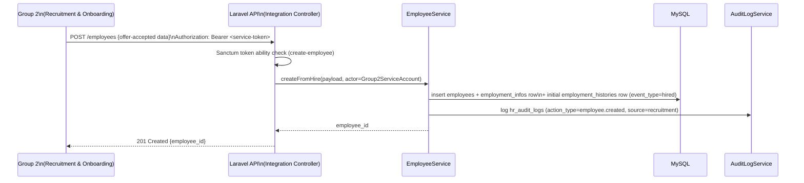
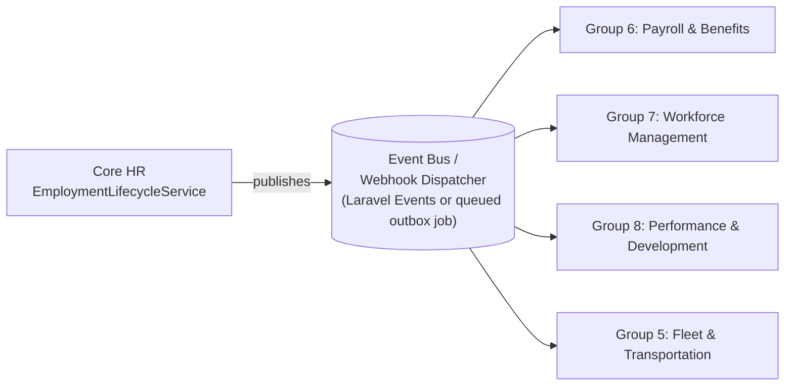

# Core HR (Group 4) — Integration Contract

Defines how Groups 1, 2, 3, 5, 6, 7, and 8 integrate with Core HR. Core HR is the
**sole authoritative source** for employee and organizational master data; this
contract exists so other groups never need (and are never permitted) to duplicate that
data as a second source of truth.

**Related documents:**
[`project-analysis.md`](./project-analysis.md) ·
[`requirements.md`](./requirements.md) ·
[`architecture.md`](./architecture.md) ·
[`ai-architecture.md`](./ai-architecture.md) ·
[`database-design.md`](./database-design.md) ·
[`api-contract.md`](./api-contract.md)

**Status:** Draft contract proposal from Group 4. Actual field needs of Groups
1/2/3/5/6/7/8 have not been formally gathered from those teams; this document defines
what Core HR is *willing and able* to expose, and a change-request process for groups
to request additions. Items requiring confirmation are marked `ASSUMPTION`. Field names
below use Laravel's `snake_case` convention to match the underlying Eloquent models
(see `database-design.md`) exactly — the same JSON shape used internally is what other
groups receive, just filtered/minimized. This document covers the **cross-group**
(service-to-service) surface; the first-party React↔Laravel contract used by Group 4's
own frontend is in [`api-contract.md`](./api-contract.md).

---

## 1. Contract Principles

1. **Read-mostly for consumers.** Other groups may read Core HR data via API or
   subscribe to change events. They may not write to Core HR's tables, directly or by
   proxy, except through the one explicit exception in §2.3 (Recruitment → Core HR
   "create employee on hire").
2. **Versioned and additive.** The API is versioned (`/api/core-hr/v1/...`).
   Breaking changes require a new version; existing consumers on `v1` must continue to
   work until they migrate.
3. **Minimal necessary fields per consumer.** Each consumer's endpoint/event payload
   only includes fields relevant to that group's function — this mirrors the same
   data-minimization principle applied to the AI service (see `ai-architecture.md`
   §6), applied here to inter-system integration rather than LLM prompts.
4. **No shared database.** Integration happens exclusively over network APIs/events;
   no other group is granted direct database credentials to the Core HR schema.
5. **Idempotency & eventual consistency.** Event consumers must handle at-least-once
   delivery and design idempotent handlers keyed on `event_id`.
6. **Change requests, not workarounds.** If a group needs a field Core HR doesn't yet
   expose, the resolution is a contract change request (§7), not an independent copy of
   Core HR data.

---

## 2. Synchronous Read API

Base path: `/api/core-hr/v1/` (the same Laravel route prefix/versioning as
`api-contract.md`, routed to a distinct set of controllers —
`App\Http\Controllers\Api\Integration\*` — so cross-group traffic can be rate-limited,
logged, and evolved independently of the first-party React API even though it shares
infrastructure).

**Authentication:** Laravel Sanctum **personal access tokens**, one issued per
consuming group/service (e.g., a token named `group-6-payroll-service`), scoped via
Sanctum's token abilities to read-only integration endpoints only (`can:read-employee`,
`can:read-org-structure`, etc.) — a token issued to Group 6 cannot, for example, call
Group 4's internal HR-Admin-only endpoints, because Sanctum ability checks are enforced
in addition to normal Policy checks. `ASSUMPTION`: If the client's real environment has
a platform-wide service-to-service auth mechanism (mutual TLS, an API gateway, signed
JWTs), Core HR's integration endpoints should use that instead — Sanctum tokens are
proposed here specifically because they require no additional package beyond what
`architecture.md` §3.2 already selects for first-party auth.

### 2.1 Employee lookups

| Endpoint | Method | Purpose | Representative response fields |
|---|---|---|---|
| `/employees/{employee_id}` | GET | Fetch a single employee's integration-safe profile | `employee_id`, `full_name`, `employment_status`, `department_id`, `department_name`, `position_id`, `position_title`, `branch_id`, `branch_name`, `hire_date`, `manager_employee_id` |
| `/employees` | GET | Paginated list/search (filter by `department_id`, `branch_id`, `status`) | Same shape as above, paginated (Laravel `paginate()` envelope, see §2.2) |
| `/employees/{employee_id}/employment-summary` | GET | Employment status + key dates for eligibility checks (e.g., payroll cutoffs, benefits eligibility) | `employee_id`, `employment_status`, `employment_type`, `hire_date`, `separation_date` (if applicable), `last_promotion_date` |
| `/employees/{employee_id}/history` | GET | Read-only employment history ledger (for context in performance/succession views) | List of `{event_type, effective_date, department_id, position_id, branch_id}` — reason free-text excluded |
| `/org/departments` | GET | Department list/hierarchy | `department_id`, `name`, `parent_department_id`, `branch_id` |
| `/org/positions` | GET | Position list | `position_id`, `title`, `department_id`, `grade_level` |
| `/org/branches` | GET | Branch/location list | `branch_id`, `name`, `location_address` |

**Explicitly excluded from every cross-group response by default**: contact info
(phone/email/address), emergency contacts, government IDs, financial/bank data,
date of birth, civil status, free-text HR notes, document contents, AI-generated
profile/document content, audit log entries. A consumer that believes it has a
legitimate need for an excluded field must go through the change-request process
(§7) — the default posture is exclusion, matching the data-minimization principle used
elsewhere in this design.

### 2.2 Response envelope (indicative)

Same Laravel API Resource envelope as `api-contract.md` §1, for consistency across
both first-party and cross-group traffic:

```json
{
  "data": { "employee_id": 123, "full_name": "Jane Dela Cruz", "...": "..." },
  "meta": { "api_version": "v1", "requested_at": "2026-09-02T12:00:00Z" }
}
```

`ASSUMPTION`: Exact envelope/error schema should align with an MMS-program-wide API
standard if one exists; not yet supplied, so `api-contract.md`'s Laravel-default
envelope is reused here as a reasonable default.

### 2.3 The one write path: "Create employee on hire" (Recruitment & Onboarding → Core HR)

Group 2 (Recruitment & Onboarding) owns the hiring/offer process up to the point an
applicant accepts an offer. At that point, Group 2 calls Core HR to **create** the
authoritative employee master record — this is a deliberate, narrow exception because
the employee does not exist in Core HR until this moment.

| Endpoint | Method | Caller | Purpose |
|---|---|---|---|
| `/employees` | POST | Group 2 (Recruitment & Onboarding), service-to-service (Sanctum token scoped to `create-employee` ability only) | Create a new `employees` row + initial `employment_infos` row from accepted-offer data (name, personal info collected during onboarding, starting department/position/branch, hire date), via `EmployeeService::createFromHire()` |

After creation, **Core HR owns the record exclusively**; Group 2 has no further write
access. Any subsequent change (e.g., correcting a typo in the new hire's name) goes
through Core HR's own HR Staff/Admin UI, not back through Group 2.

`ASSUMPTION`: The precise new-hire data Group 2 already collects (and thus can supply
at creation time) vs. what Core HR must additionally request from the employee/HR is
not yet defined; to be confirmed jointly with the Group 2 team.



---

## 3. Asynchronous Domain Events

For consumers that need near-real-time notification of changes (rather than polling),
Core HR publishes domain events. `ASSUMPTION`: the concrete event transport is an
infrastructure decision for the MMS program, not fixed by Group 4 alone. Two Laravel-
native options fit this design without extra packages:

- **If Core HR shares a Laravel monolith with other groups** (`project-analysis.md`
  §2.3 Assumption A0, scenario b): native Laravel **Events + Queued Listeners**
  (`Illuminate\Events`), where `EmployeeLifecycleService` fires an `EmployeeCreated`
  event and other groups' modules register their own `ShouldQueue` listeners — no
  network hop needed.
- **If Core HR is a separate application** (scenario a/c): the same event is also
  dispatched to an **outbox table + webhook dispatcher** (a queued job that `POST`s
  the payload to each subscribing group's registered webhook URL, with retry), or to
  a message broker (Kafka/RabbitMQ/SQS) if the MMS program standardizes on one.

Either way, the event **payload contracts** below are transport-agnostic and
identical regardless of which delivery mechanism the program selects.

### 3.1 Published events

| Event | Emitted when | Payload (representative) | Likely consumers |
|---|---|---|---|
| `employee.created` | New employee record created | `employee_id`, `full_name`, `department_id`, `position_id`, `branch_id`, `hire_date` | Groups 6, 7, 8 (initialize payroll/workforce/performance records) |
| `employee.employment_status_changed` | Status changes (active/on-leave/suspended/resigned/terminated) | `employee_id`, `previous_status`, `new_status`, `effective_date` | Groups 6 (stop/adjust payroll), 7 (remove from scheduling), 8 (close performance cycle), 5 (revoke vehicle assignment) |
| `employee.transferred` | Approved department/branch transfer | `employee_id`, `from_department_id`, `to_department_id`, `from_branch_id`, `to_branch_id`, `effective_date` | Groups 6, 7, 8, 5 |
| `employee.promoted` | Approved position/grade change | `employee_id`, `from_position_id`, `to_position_id`, `effective_date` | Groups 6 (pay grade re-evaluation trigger — actual computation stays in Group 6), 8 |
| `employee.separated` | Resignation/termination approved | `employee_id`, `separation_type`, `last_working_day` | Groups 6, 7, 8, 5 |
| `org.department_changed` / `org.position_changed` / `org.branch_changed` | Org structure edits | Entity id + changed fields | All consuming groups (to refresh cached reference data, if any) |

### 3.2 Event contract rules

- Every event includes `event_id` (UUID), `occurred_at`, `event_type`, `version`, and a
  `data` payload — consumers must ignore unknown additional fields (forward
  compatibility) and must not break on additive payload changes.
- Events carry **identifiers and structured facts only** — never free-text notes,
  never documents, never AI-generated content, never contact/financial/government-ID
  data. Consumers needing display-friendly details (e.g., a name) beyond the IDs
  should call the synchronous read API (§2) rather than expect it to always ride along
  on every event, keeping event payloads small and stable.
- Core HR guarantees **at-least-once** delivery; consumers must be idempotent
  (dedupe on `event_id`).



---

## 4. Per-Group Integration Summary

### 4.1 Group 1 — Supply Chain & Inventory Management
- **Need (assumed)**: Employee identity for accountability fields on inventory
  transactions (e.g., "requested by", "received by", "approved by" — referencing an
  `employee_id`).
- **Contract**: Read-only `/employees/{employee_id}` lookups for display/validation
  purposes only (does not need employment history, org structure beyond current
  department/branch).
- `ASSUMPTION`: Group 1's exact touchpoint with HR data is unconfirmed; flagged for
  joint requirements discussion.

### 4.2 Group 2 — Recruitment and Onboarding
- **Need**: (a) Create the authoritative employee record once an offer is accepted
  (§2.3); (b) read org structure (`/org/departments`, `/org/positions`, `/org/branches`)
  to populate offer/onboarding forms with valid department/position/branch choices.
- **Contract**: One write endpoint (`POST /employees`, exception per §2.3) + read-only
  org-structure endpoints.
- **Boundary**: Once created, Group 2 has no further write access to the employee
  record; any post-hire correction is a Core HR action.

### 4.3 Group 3 — Financial Management System (Transaction Core)
- **Need (assumed)**: Employee identity for approval-chain/accountability fields in
  financial transactions (e.g., who approved a disbursement).
- **Contract**: Read-only `/employees/{employee_id}` lookups (name, position, department
  for approval-authority display/validation), and potentially `/org/departments` for
  cost-center-like groupings if departments double as cost centers `(ASSUMPTION:
  whether Group 3's "cost center" concept maps 1:1 to Core HR's `Department` is
  unconfirmed and should be clarified jointly)`.

### 4.4 Group 5 — Fleet & Transportation Management
- **Need**: Driver/employee identity, department/branch, for vehicle assignment,
  driver eligibility, and accountability in trip/vehicle records.
- **Contract**: Read-only `/employees/{employee_id}` and `/employees?branch_id=...`
  lookups; subscribes to `employee.employment_status_changed` and
  `employee.transferred` to revoke/reassign vehicle access when an employee separates
  or moves branches.

### 4.5 Group 6 — Payroll & Benefits
- **Need**: Full employment status/history context to compute pay and determine
  benefits eligibility: hire date, employment type/status, department/position
  (for pay-grade mapping — actual pay-grade tables are owned by Group 6), separation
  date.
- **Contract**: Read-only `/employees/{employee_id}/employment-summary` and
  `/employees/{employee_id}/history`; subscribes to `employee.created`,
  `employee.employment_status_changed`, `employee.promoted`, `employee.separated`.
- **Boundary**: Salary figures, bank account details, and payslip data are owned
  entirely by Group 6 and never stored in or requested from Core HR (and, per
  `ai-architecture.md` §6, never sent to the AI service even if they existed in Core
  HR).

### 4.6 Group 7 — Workforce Management
- **Need**: Employee master data, department/branch, employment status for scheduling
  eligibility, attendance context, and leave-management eligibility rules.
- **Contract**: Read-only `/employees/{employee_id}`, `/employees?department_id=...`;
  subscribes to `employee.created`, `employee.employment_status_changed`,
  `employee.transferred`, `employee.separated`.
- **Boundary**: Actual shift schedules, timesheets, and leave balances are owned by
  Group 7 and not duplicated into Core HR.

### 4.7 Group 8 — Performance & Development
- **Need**: Employee master data, position, department, employment history, and (once
  approved) `employee_profiles` summaries as optional input context for performance
  reviews or succession planning.
- **Contract**: Read-only `/employees/{employee_id}`, `/employees/{employee_id}/history`;
  optionally a read-only `/employees/{employee_id}/approved-profile` returning only the
  latest `approved` row from `employee_profiles` (never a `draft_generated` one);
  subscribes to `employee.promoted`, `employee.transferred`, `employee.separated`.
- **Boundary**: Performance ratings, competency scores, training completion tracking,
  and succession plans are owned by Group 8 and are not sent back into Core HR's AI
  context (see `ai-architecture.md` §6.2 — performance ratings explicitly excluded from
  the profiling allow-list).

---

## 5. What Core HR Explicitly Will NOT Expose

| Data | Reason |
|---|---|
| Passwords / auth credentials / session tokens | Security — never exposed via any API, internal or external. |
| Government ID numbers (SSS, TIN, PhilHealth, Pag-IBIG, passport, etc.) | Data minimization / privacy; no confirmed cross-group need. |
| Bank/financial account information | Not stored in Core HR at all; owned by Group 6. |
| Free-text HR notes/remarks | Sensitive, unstructured, high injection/leak risk; excluded from all external contracts. |
| Raw AI prompts/responses (`ai_request_logs` content) | Internal to Group 4's AI governance; not a cross-group integration concern, and excluded from persistence per `ai-architecture.md` §7. |
| `draft`/`for_review`/unapproved `hr_documents` or `employee_profiles` content | Not yet human-approved; exposing unapproved AI output outside Group 4 would violate the "AI is assistive only, human review required" principle. |
| `hr_audit_logs` entries | Internal compliance/audit concern for Core HR (and, at most, platform-wide security/audit tooling) — not a functional integration need for other groups. |

---

## 6. API Versioning & Deprecation Policy

- New fields may be added to existing response payloads at any time (additive,
  non-breaking); consumers must tolerate unknown fields.
- Removing or renaming a field, or changing a field's type/semantics, requires a new
  API version (`v2`) published alongside `v1` for a deprecation window
  `(ASSUMPTION: deprecation window length, e.g., 2 release cycles or N months, pending
  MMS program-level API governance policy)`.
- New event types are additive; existing event payload contracts follow the same
  non-breaking-change rule as REST responses.

---

## 7. Change Request Process (proposed)

1. A consuming group identifies a data need not currently covered by this contract.
2. The group submits a request to Group 4 describing the specific field(s), the
   business justification, and the sensitivity tier of the requested data (per
   `ai-architecture.md` §6.1 classification, reused here for consistency).
3. Group 4 evaluates against data-minimization principles: is the field truly
   necessary for the consumer's function, or can the consumer's need be met with an
   existing field or a derived/aggregated value instead?
4. If approved, Group 4 adds the field to the relevant endpoint/event as an additive
   change (or, if it requires new sensitivity handling, documents the exception
   explicitly in this file with the approving stakeholder noted).
5. `ASSUMPTION`: No formal cross-group governance board is confirmed to exist yet for
   the MMS program; this process assumes direct team-to-team coordination unless the
   client establishes a central integration/architecture review function.

---

*End of `integration-contract.md`. This is the single authoritative reference for how
Groups 1, 2, 3, 5, 6, 7, and 8 are expected to consume Core HR (Group 4) data; any
integration not described here should be treated as unapproved until added through the
change-request process above.*
