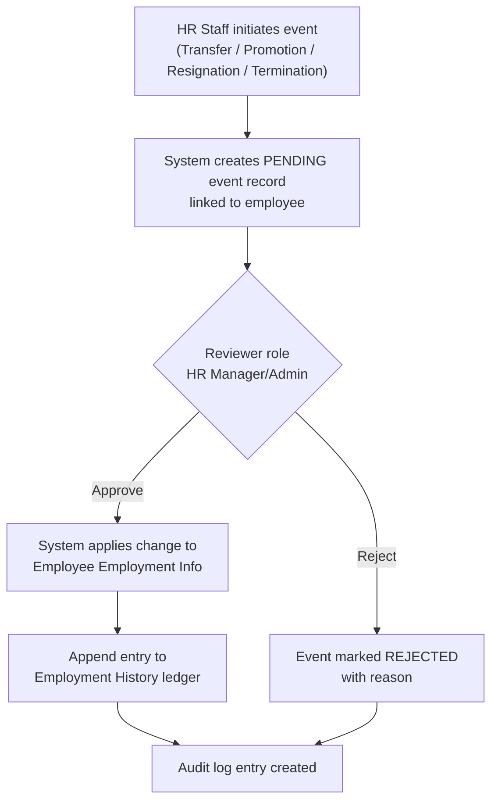
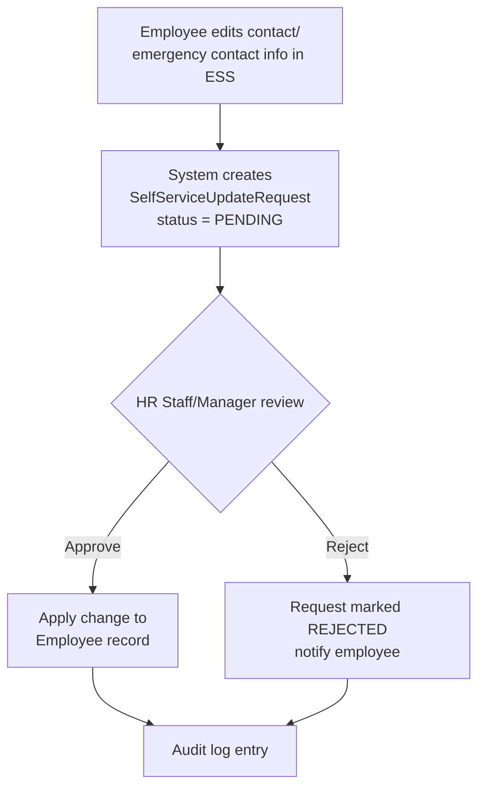
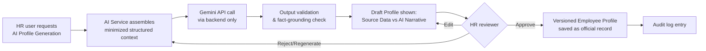
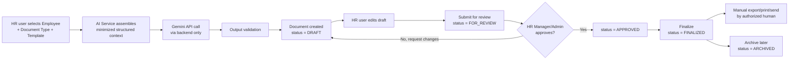

# Core HR (Group 4) — Requirements Specification

**Project:** Design and Development of a Gemini-Assisted Core Human Resource Management
Subsystem for Automated Document Drafting and Employee Profiling Using Large Language
Model Technology.

**Parent System:** Microfinancial Management System (MMS)

**Owning Group:** Group 4 — Core HR

**Document status:** Draft for client/stakeholder confirmation. Items explicitly marked
`ASSUMPTION` are not yet confirmed by the client and must be validated before or during
implementation.

**Related documents:**
[`project-analysis.md`](./project-analysis.md) ·
[`architecture.md`](./architecture.md) ·
[`ai-architecture.md`](./ai-architecture.md) ·
[`database-design.md`](./database-design.md) ·
[`api-contract.md`](./api-contract.md) ·
[`integration-contract.md`](./integration-contract.md)

---

## 1. System Scope

### 1.1 Technology Stack

Per the project brief, Group 4 is implemented on a fixed technology stack (see
[`project-analysis.md`](./project-analysis.md) for the inspection confirming no
existing codebase constrains these choices):

| Layer | Technology |
|---|---|
| Backend | Laravel (PHP), exposing a RESTful JSON API |
| Frontend | React (JavaScript/TypeScript SPA) |
| Database | MySQL, managed exclusively through Laravel migrations/Eloquent (local dev via XAMPP) |
| AI provider | Google Gemini API, called only from the Laravel backend — never from React |

All functional and non-functional requirements below are written to be implementable
on this stack; where a requirement implies a specific Laravel/React mechanism (e.g.,
Form Requests, Sanctum, Eloquent), that is called out explicitly. Full technical
architecture is in [`architecture.md`](./architecture.md); the Gemini integration
design is in [`ai-architecture.md`](./ai-architecture.md); the schema/migration plan
is in [`database-design.md`](./database-design.md); the concrete route list is in
[`api-contract.md`](./api-contract.md).

The Microfinancial Management System (MMS) is decomposed into eight subsystem groups,
each owned by a different development team:

| Group | Subsystem |
|---|---|
| 1 | Supply Chain & Inventory Management |
| 2 | Recruitment and Onboarding |
| 3 | Financial Management System (Transaction Core) |
| **4** | **Core HR (this project)** |
| 5 | Fleet & Transportation Management |
| 6 | Payroll & Benefits |
| 7 | Workforce Management |
| 8 | Performance & Development |

**Group 4 — Core HR** is responsible for exactly three functional areas:

1. **Core Human Capital Management (HCM)** — the employee master record, employment
   data, organizational structure, and employment lifecycle events (transfers,
   promotions, resignation/termination).
2. **Employee Self-Service (ESS)** — employee-facing views of their own record and
   limited self-maintained data (e.g., contact/emergency contact updates), subject to
   HR review where appropriate.
3. **Employee Records Management (added)** — document templates, generated HR
   documents, document lifecycle/versioning, and the HR audit trail.

Core HR additionally owns two **AI-assisted capabilities**, both of which are strictly
**assistive** — they never make employment decisions, never auto-approve HR actions,
never write directly to authoritative employee records, and never transmit official
documents without a human-in-the-loop review and approval step:

- **AI Feature 1 — Gemini-Assisted Employee Profiling**
- **AI Feature 2 — Gemini-Assisted Automated HR Document Drafting**

Group 4 is the **single authoritative source (system of record)** for employee master
data and organizational structure data across the entire MMS. All other groups consume
this data via well-defined integration contracts (see
[`integration-contract.md`](./integration-contract.md)) rather than maintaining their
own copies of the same facts.

---

## 2. In-Scope Features

### 2.1 Core HR data & lifecycle
- Employee master data (identity, personal info, contact info, emergency contacts)
- Employment information (status, department, position, branch/location)
- Organizational structure (departments, positions, reporting lines, branches)
- Employment history (a chronological ledger of employment-affecting events)
- Employee transfers (branch/department/position changes)
- Employee promotions (position/rank/grade changes)
- Resignation / termination records and offboarding status
- Employee documents (uploaded files: contracts, IDs, certificates — metadata + storage
  reference, not AI-generated)
- Employee Self-Service views and limited self-service edits (contact info, emergency
  contacts) subject to configurable HR approval
- User roles and permissions (RBAC) scoped to Core HR resources
- HR audit trail for all Core HR mutating actions and AI-assisted actions

### 2.2 AI-assisted employee profiling
- On-demand generation of a structured employee profile (professional summary,
  employment history summary, role/responsibility summary, skills & competencies
  summary, training & development summary, career history summary) from **structured,
  approved** employee data only
- Clear visual/structural separation between database-sourced facts and
  AI-generated narrative text
- Mandatory human review before a generated profile can be saved as, or attached to,
  an official HR record
- Versioned storage of generated profiles with reviewer attribution

### 2.3 AI-assisted document drafting
- Selection of an employee + an approved document template + document type
- AI-assisted draft generation using structured employee data merged into the template
- Full-text editing of the draft by an authorized HR user prior to approval
- A defined document lifecycle: `DRAFT → FOR_REVIEW → APPROVED → FINALIZED → ARCHIVED`
- Document template management (versioned, approved templates only)
- Document draft history (every generation + edit + approval event retained)

### 2.4 AI service infrastructure (server-side only)
- Gemini API integration isolated in a dedicated backend AI service/module
- Prompt template management and versioning
- Context preparation with data-minimization filtering
- Input validation, output validation, and fact-grounding checks
- Token/context budget management
- Retry and error handling
- AI request/response audit logging (metadata-level, privacy-aware)
- Human review workflow gating all AI outputs

### 2.5 Integration
- Read-oriented APIs/events that let Groups 1, 2, 3, 5, 6, 7, 8 consume Core HR employee
  and organizational data without duplicating it as a second source of truth

---

## 3. Out-of-Scope Features

The following are explicitly **out of scope** for Group 4 and belong to other groups or
are excluded entirely from this project phase:

| Excluded item | Rationale / Owner |
|---|---|
| Recruitment, applicant tracking, job requisitions, new-hire onboarding workflow | Group 2 — Recruitment & Onboarding |
| Payroll computation, compensation planning, benefits/claims administration | Group 6 — Payroll & Benefits |
| Time & attendance, shift/schedule management, timesheets, leave management | Group 7 — Workforce Management |
| Performance appraisal workflows, competency scoring, learning management, succession planning, social recognition | Group 8 — Performance & Development |
| Fleet, vehicle reservation, driver/trip monitoring | Group 5 — Fleet & Transportation Management |
| General ledger, AP/AR, disbursement, budget, financial reporting | Group 3 — Financial Management System |
| Inventory, warehousing, procurement, supplier management | Group 1 — Supply Chain & Inventory Management |
| Autonomous AI decision-making (auto-approval of transfers/promotions/terminations, auto-sending of official documents) | Explicitly disallowed by AI governance requirement |
| AI training/fine-tuning of custom models on employee data | Not required; system uses Gemini via API only |
| E-signature / legally binding digital signature infrastructure | `ASSUMPTION`: out of scope unless client confirms; FINALIZED documents assumed to be exported as PDF and signed through an existing/external process |
| Public-facing employee mobile app | `ASSUMPTION`: ESS is assumed to be a web module inside MMS, not a separate mobile app, unless confirmed otherwise |

---

## 4. Functional Requirements

IDs use the prefix `FR-<area>-<n>` for traceability into design and test artifacts.

### 4.1 Employee Master Data & Records (FR-EMP)

| ID | Requirement |
|---|---|
| FR-EMP-01 | The system shall maintain one authoritative employee master record per employee, uniquely identified by an internal Employee ID. |
| FR-EMP-02 | The system shall capture personal information: full name, date of birth, gender, civil status, nationality `(ASSUMPTION: exact field set pending HR form confirmation)`. |
| FR-EMP-03 | The system shall capture contact information: mobile number, personal email, work email, current address, permanent address. |
| FR-EMP-04 | The system shall capture one or more emergency contacts per employee (name, relationship, phone number, address). |
| FR-EMP-05 | The system shall capture employment information: hire date, employment type (regular/probationary/contractual/part-time), employment status (active/on-leave/suspended/resigned/terminated), department, position, branch/location, reporting manager. |
| FR-EMP-06 | The system shall maintain an organizational structure of departments, positions, and branches/locations, including a reporting hierarchy. |
| FR-EMP-07 | The system shall record employment history as an append-only ledger of events (hire, transfer, promotion, status change, resignation, termination), each with effective date, reason, and actor. |
| FR-EMP-08 | The system shall allow authorized HR users to record employee transfers (department/branch/position change) with effective date and approver. |
| FR-EMP-09 | The system shall allow authorized HR users to record employee promotions (position/grade change) with effective date and approver. |
| FR-EMP-10 | The system shall allow authorized HR users to record resignation and termination events, including last working day, clearance status, and offboarding notes. |
| FR-EMP-11 | The system shall allow upload and metadata tracking of employee documents (e.g., signed contracts, valid IDs, certificates) with document type, upload date, and uploader. |
| FR-EMP-12 | The system shall provide an Employee Self-Service view where an employee can view their own master data, employment history, and documents. |
| FR-EMP-13 | The system shall allow an employee to submit changes to their own contact information and emergency contacts; changes shall require HR approval before becoming part of the authoritative record `(ASSUMPTION: approval-required workflow; direct self-edit without review is not assumed by default)`. |
| FR-EMP-14 | The system shall prevent employees from directly viewing or editing other employees' records via ESS. |
| FR-EMP-15 | The system shall expose Core HR employee/org data to other MMS subsystems only through defined, versioned integration APIs/events (see `integration-contract.md`), never via direct database access. |
| FR-EMP-16 | All incoming write requests (create/update employee, org, lifecycle, document data) shall be validated using Laravel Form Requests before reaching business logic; invalid requests shall return standard Laravel validation error responses (422 with field-level messages). |

### 4.2 AI-Assisted Employee Profiling (FR-PROF)

| ID | Requirement |
|---|---|
| FR-PROF-01 | The system shall allow an authorized HR user to request AI-assisted profile generation for a specific employee. |
| FR-PROF-02 | The system shall build the AI context solely from structured, approved employee data existing in the Core HR database at the time of generation (see §13 and `ai-architecture.md` §6.2 for the allowed field list). |
| FR-PROF-03 | The generated profile shall include, where data supports it: professional summary, employment history summary, role & responsibility summary, skills & competencies summary, training & development summary, career history summary. |
| FR-PROF-04 | The system shall visually and structurally separate "Source Data" (verbatim/derived facts from the database) from "AI-Generated Narrative" (Gemini-produced prose) in the profile UI and stored artifact. |
| FR-PROF-05 | The system shall not allow an AI-generated profile to be saved as an official HR record without explicit review and approval by an authorized HR user. |
| FR-PROF-06 | The system shall allow the reviewing HR user to edit, regenerate, or reject an AI-generated profile before approval. |
| FR-PROF-07 | The system shall version every approved profile and retain prior versions for audit purposes. |
| FR-PROF-08 | If the underlying employee data is insufficient to support a requested summary section (e.g., no training records), the system shall omit or flag that section rather than allow the AI to fabricate content. |
| FR-PROF-09 | The system shall run an output validation pass that flags AI narrative content referencing facts (names, dates, figures) not traceable to the supplied structured context, for HR reviewer attention. |

### 4.3 AI-Assisted Document Drafting (FR-DOC)

| ID | Requirement |
|---|---|
| FR-DOC-01 | The system shall allow an authorized HR user to select an employee and a document type/template to initiate draft generation. |
| FR-DOC-02 | The system shall maintain a library of HR-approved document templates, each with a defined type, required data fields, and version number. |
| FR-DOC-03 | The system shall merge structured employee data into the selected template and use Gemini to draft narrative/boilerplate sections only where the template calls for AI-composed language. |
| FR-DOC-04 | Every generated document shall be created with status `DRAFT` and shall not be considered official until it passes through the full lifecycle to `APPROVED`/`FINALIZED`. |
| FR-DOC-05 | The system shall allow the requesting/reviewing HR user to fully edit the draft text before submitting it for review. |
| FR-DOC-06 | The system shall enforce the document lifecycle `DRAFT → FOR_REVIEW → APPROVED → FINALIZED → ARCHIVED`, with role-gated transitions (see §6 and §4.5). |
| FR-DOC-07 | The system shall prevent a document from transitioning to `FINALIZED` unless it has first passed through `APPROVED` by a user with document-approval permission. |
| FR-DOC-08 | The system shall retain full draft history: every generation, edit, and status transition, with actor and timestamp. |
| FR-DOC-09 | The system shall not allow AI to auto-send, auto-email, or auto-transmit any generated document; transmission/printing/export is a manual, human-triggered action available only on `FINALIZED` documents. |
| FR-DOC-10 | The system shall support template versioning; documents shall record which template version they were generated from. |
| FR-DOC-11 | The system shall support at minimum the following document types: Certificate of Employment, Employment Certificate, Appointment Letter, Promotion Letter, Transfer Letter, HR Memorandum, Notice Letter, and an extensible "Other HR-approved document" category `(ASSUMPTION: exact legal wording per document type requires HR/legal template sign-off before go-live)`. |

### 4.4 AI Service / Platform Requirements (FR-AI)

| ID | Requirement |
|---|---|
| FR-AI-01 | All Gemini API calls shall originate from a dedicated Laravel backend service class (see `ai-architecture.md` §2); the API key/credentials shall be stored only in the Laravel `.env` file / `config/services.php` and shall never be exposed to the React frontend or any client-side code. |
| FR-AI-02 | The AI service shall apply a data-minimization filter to strip or mask fields not required for the requested AI task before constructing any prompt (see §13 and `ai-architecture.md` §6). |
| FR-AI-03 | The AI service shall validate inputs (e.g., required fields present, employee status eligible) before calling Gemini. |
| FR-AI-04 | The AI service shall validate outputs (e.g., structure/schema conformance, fact-grounding heuristics, length limits, prohibited content checks) before returning results to the requesting UI. |
| FR-AI-05 | The AI service shall manage token/context budgets, truncating or summarizing input context as needed while preserving required factual fields. |
| FR-AI-06 | The AI service shall implement retry with backoff for transient Gemini API failures and shall surface a clear error state to the user on exhaustion of retries. |
| FR-AI-07 | The AI service shall log every AI request/response at a metadata level (see `ai-architecture.md` §7) without persisting raw sensitive employee data in logs. |
| FR-AI-08 | The AI service shall tag every stored AI request with a prompt-template identifier and version, and the Gemini model identifier/version used. |
| FR-AI-09 | No AI-generated content shall be marked "official" or usable downstream until an authorized human reviewer has explicitly approved it. |

### 4.5 Roles & Permissions (FR-SEC)

| ID | Requirement |
|---|---|
| FR-SEC-01 | The system shall implement role-based access control (RBAC) with, at minimum, the roles: HR Administrator, HR Manager, HR Staff, System Administrator, and Employee (self-service) `(ASSUMPTION: "Employee" role added to satisfy ESS requirement; client to confirm exact role list/naming)`. |
| FR-SEC-02 | The system shall restrict record-level access to Employee Self-Service users to their own record only, enforced via Laravel Policies/Gates on every relevant controller action. |
| FR-SEC-03 | The system shall enforce that only roles with document-approval permission may transition a document from `FOR_REVIEW` to `APPROVED`, and only roles with finalization permission may transition `APPROVED` to `FINALIZED`. |
| FR-SEC-04 | The system shall enforce that AI generation actions (profiling, drafting) are only available to roles explicitly granted the corresponding permission. |
| FR-SEC-05 | The system shall log all permission-denied attempts on sensitive actions for security review. |
| FR-SEC-06 | The system shall authenticate users via Laravel Sanctum (SPA session auth for the React frontend; personal access tokens for service-to-service calls from other MMS groups). |

### 4.6 Auditability (FR-AUD)

| ID | Requirement |
|---|---|
| FR-AUD-01 | The system shall record an audit entry for every create/update/status-change action on employee master data, employment events, documents, and templates. |
| FR-AUD-02 | The system shall record an audit entry for every AI generation request and every human review decision (approve/reject/edit) associated with AI output. |
| FR-AUD-03 | Audit entries shall capture: acting user, action type, timestamp, affected employee (if any), affected document/profile (if any), AI feature used (if any), prompt template + version (if any), model identifier (if any), result status, and approval action (if any). |
| FR-AUD-04 | Audit entries shall not store the raw AI prompt or raw AI response text when that content includes sensitive personal data; a redacted/reference form shall be stored instead (see `ai-architecture.md` §7). |
| FR-AUD-05 | The audit trail shall be read-only/append-only from an application perspective (no update or delete via normal application flows).|

---

## 5. Non-Functional Requirements

| Category | ID | Requirement |
|---|---|---|
| **Security** | NFR-SEC-01 | Gemini API credentials shall be stored in the Laravel `.env` file (read via `config/services.php`), never committed to source control (`.env` remains git-ignored), never in client code, and never logged. |
| **Security** | NFR-SEC-02 | All API traffic shall use TLS in transit; data at rest for PII fields shall be encrypted per platform standard `(ASSUMPTION: exact encryption standard, e.g., AES-256 at column level vs. disk-level, to be confirmed with infra/security team)`. |
| **Security** | NFR-SEC-03 | Authentication/session tokens shall never be included in any AI prompt context. |
| **Privacy** | NFR-PRIV-01 | The system shall apply data minimization: only fields explicitly whitelisted per AI task (see `ai-architecture.md` §6) are eligible to be sent to Gemini. |
| **Privacy** | NFR-PRIV-02 | Government ID numbers, financial account numbers, passwords/credentials, and other fields not required for the specific AI task shall never be included in prompts. |
| **Reliability** | NFR-REL-01 | AI feature unavailability (e.g., Gemini API outage) shall not block core, non-AI HR functions (CRUD on employee records, manual document creation). |
| **Reliability** | NFR-REL-02 | The AI service shall apply retry/backoff and circuit-breaking to avoid cascading failures from the external Gemini API. |
| **Performance** | NFR-PERF-01 | Non-AI Core HR CRUD operations shall respond within typical interactive thresholds (`ASSUMPTION`: target P95 < 500 ms server-side, pending infra sizing). |
| **Performance** | NFR-PERF-02 | AI generation requests are long-running relative to CRUD; the UI shall treat them asynchronously (loading/progress state, ability to cancel) rather than assume sub-second response. |
| **Auditability** | NFR-AUD-01 | Audit logs shall be retained for a minimum period aligned with HR/legal record retention policy `(ASSUMPTION: retention period, e.g., 7 years, pending client/legal confirmation)`. |
| **Maintainability** | NFR-MAINT-01 | The AI provider integration shall be abstracted behind an internal PHP interface/contract (e.g., an `AIProvider` interface bound in the Laravel service container) so the Gemini SDK/API can be replaced or versioned with minimal impact on calling code. |
| **Maintainability** | NFR-MAINT-02 | Prompt templates shall be stored as versioned, editable database records (Eloquent-managed) rather than hardcoded PHP strings, so non-engineering HR/compliance stakeholders can review wording changes without a code deployment. |
| **Usability** | NFR-USE-01 | AI-generated content shall be visually distinguished (e.g., badge/label "AI-generated — pending review") anywhere it appears in the React UI. |
| **Compliance** | NFR-COMP-01 | The system's handling of personal data shall be designed to be compatible with the Philippine Data Privacy Act of 2012 (RA 10173) principles of transparency, legitimate purpose, and proportionality `(ASSUMPTION: jurisdiction inferred from "Microfinancial" + document artifacts; to be confirmed with client/legal)`. |
| **Portability** | NFR-PORT-01 | The Core HR service shall expose its integration APIs as a versioned Laravel REST API (JSON, `/api/core-hr/v1/...`) so other groups can integrate regardless of their internal stack. See `api-contract.md`. |
| **Reproducibility** | NFR-REPR-01 | The entire database schema shall be reproducible from source control via `php artisan migrate` (migrations) and `php artisan db:seed` (seeders/factories) alone; no schema object shall be created only through phpMyAdmin or manual SQL. |

---

## 6. User Roles

| Role | Description |
|---|---|
| **System Administrator** | Manages platform-level configuration: user accounts, role assignments, integration credentials, template publishing infrastructure, system health. Not necessarily an HR domain expert. |
| **HR Administrator** | Highest HR authority in the system. Full CRUD over employee master data, organizational structure, templates; can approve and finalize documents and profiles; can archive records; manages HR role assignments. |
| **HR Manager** | Departmental/branch HR leadership. Can view/edit employee records within scope, approve documents/profiles (`FOR_REVIEW → APPROVED`), request AI generation, cannot manage templates or system-wide roles (`ASSUMPTION`: scope — e.g., "within assigned branch/department" — pending org-chart confirmation). |
| **HR Staff** | Day-to-day HR operations: create/edit employee records, initiate transfers/promotions (subject to approval), request AI profile/document generation, edit AI drafts, submit for review. Cannot approve or finalize. |
| **Employee (ESS user)** | Self-service only: view own profile/history/documents, submit contact/emergency-contact update requests. No access to other employees' data, no AI generation rights. |

Exact permission matrix is defined in §4.5 and detailed per-action in the table below.

### 6.1 Role × Action Permission Matrix

| Action | HR Admin | HR Manager | HR Staff | Employee | Sys Admin |
|---|---|---|---|---|---|
| View own record (ESS) | ✅ | ✅ | ✅ | ✅ | ❌ |
| View any employee record | ✅ | ✅ (scoped) | ✅ (scoped) | ❌ | ❌ |
| Create employee record | ✅ | ✅ | ✅ | ❌ | ❌ |
| Edit employee master/employment data | ✅ | ✅ (scoped) | ✅ (scoped) | ❌ | ❌ |
| Submit self-service info update request | ❌ | ❌ | ❌ | ✅ | ❌ |
| Approve self-service update request | ✅ | ✅ | ✅ | ❌ | ❌ |
| Record transfer / promotion (draft) | ✅ | ✅ | ✅ | ❌ | ❌ |
| Approve transfer / promotion | ✅ | ✅ | ❌ | ❌ | ❌ |
| Record resignation/termination | ✅ | ✅ | ✅ (initiate) | ❌ | ❌ |
| Approve resignation/termination | ✅ | ✅ | ❌ | ❌ | ❌ |
| Manage document templates | ✅ | ❌ | ❌ | ❌ | ❌ |
| Request AI profile generation | ✅ | ✅ | ✅ | ❌ | ❌ |
| Request AI document draft generation | ✅ | ✅ | ✅ | ❌ | ❌ |
| Edit AI-generated draft | ✅ | ✅ | ✅ | ❌ | ❌ |
| Submit draft for review (`DRAFT → FOR_REVIEW`) | ✅ | ✅ | ✅ | ❌ | ❌ |
| Approve draft/profile (`FOR_REVIEW → APPROVED`) | ✅ | ✅ | ❌ | ❌ | ❌ |
| Finalize document (`APPROVED → FINALIZED`) | ✅ | ✅ | ❌ | ❌ | ❌ |
| Archive document/profile | ✅ | ✅ (own scope) | ❌ | ❌ | ❌ |
| Manage RBAC / role assignment | ✅ | ❌ | ❌ | ❌ | ✅ (platform-level) |
| View audit trail | ✅ | ✅ (scoped) | ❌ | ❌ | ✅ (platform logs) |
| Manage AI configuration (prompt templates, model params) | ✅ (with technical support) | ❌ | ❌ | ❌ | ✅ |

`ASSUMPTION`: The precise scoping of "HR Manager (scoped)" — e.g., limited to a specific
branch, department, or region — depends on the client's organizational hierarchy and
must be confirmed.

---

## 7. Use Cases

### 7.1 Core HR use cases

| ID | Use Case | Primary Actor | Summary |
|---|---|---|---|
| UC-01 | Create Employee Record | HR Staff/Admin | Capture new employee master + employment data. |
| UC-02 | Update Employee Personal/Contact Info | HR Staff/Admin | Edit existing record fields. |
| UC-03 | Submit Self-Service Info Update | Employee | Employee proposes changes to contact/emergency info; queued for HR approval. |
| UC-04 | Review Self-Service Update Request | HR Staff/Manager/Admin | Approve or reject employee-submitted changes. |
| UC-05 | Record Employee Transfer | HR Staff | Create a pending transfer record (new dept/branch/position, effective date). |
| UC-06 | Approve Employee Transfer | HR Manager/Admin | Approve pending transfer; system updates employment info & history ledger. |
| UC-07 | Record Employee Promotion | HR Staff | Create pending promotion record. |
| UC-08 | Approve Employee Promotion | HR Manager/Admin | Approve; system updates position/grade & history ledger. |
| UC-09 | Record Resignation/Termination | HR Staff | Initiate offboarding record with reason, last day, clearance checklist. |
| UC-10 | Approve Resignation/Termination | HR Manager/Admin | Approve; system updates employment status to resigned/terminated. |
| UC-11 | Upload Employee Document | HR Staff/Admin | Attach a file (contract, ID, cert) with metadata to the employee record. |
| UC-12 | Manage Organizational Structure | HR Admin | Create/edit departments, positions, branches, reporting lines. |
| UC-13 | View Employment History | Any HR role / Employee (own) | View chronological ledger of employment events. |
| UC-14 | Manage Roles & Permissions | HR Admin / System Admin | Assign roles to system users. |
| UC-15 | View Audit Trail | HR Admin/Manager | Review logged HR/AI actions. |

### 7.2 AI-assisted use cases

| ID | Use Case | Primary Actor | Summary |
|---|---|---|---|
| UC-16 | Generate AI Employee Profile | HR Staff/Manager/Admin | Request Gemini-assisted profile draft from structured employee data. |
| UC-17 | Review & Approve AI Employee Profile | HR Manager/Admin | Edit/accept/reject generated profile; approval creates an official versioned profile record. |
| UC-18 | Select Document Template & Generate Draft | HR Staff/Manager/Admin | Request Gemini-assisted document draft from employee data + template. |
| UC-19 | Edit Document Draft | HR Staff/Manager/Admin | Free-text edit of generated draft prior to submission for review. |
| UC-20 | Review & Approve Document Draft | HR Manager/Admin | Move draft `FOR_REVIEW → APPROVED`. |
| UC-21 | Finalize Document | HR Manager/Admin | Move `APPROVED → FINALIZED`; document becomes official/exportable. |
| UC-22 | Archive Document/Profile | HR Manager/Admin | Move `FINALIZED → ARCHIVED` for records retention. |
| UC-23 | Manage Document Templates | HR Admin | Create/edit/version/publish approved templates. |

### 7.3 Sample use case detail — UC-18 "Select Document Template & Generate Draft"

- **Actor:** HR Staff
- **Preconditions:** Employee record exists and is `ACTIVE` or in an eligible status for
  the chosen document type; at least one `APPROVED`/published template exists for the
  selected document type; actor holds `ai.document.generate` permission.
- **Main flow:**
  1. Actor selects an employee and a document type (e.g., "Certificate of Employment").
  2. System lists eligible, approved templates for that type; actor selects one (or the
     system auto-selects the current default version).
  3. System's Document Service requests context assembly from Core HR data layer,
     filtered by the AI Data Minimization policy for this document type.
  4. AI Service builds a prompt from the template + minimized context, calls Gemini,
     validates the output, and returns a structured draft.
  5. System creates a Document record with status `DRAFT`, stores the draft content,
     generation metadata, and links to template version + employee.
  6. Actor reviews/edits the draft text in the UI.
  7. Actor submits draft for review → status `FOR_REVIEW`.
- **Alternate flows:**
  - 4a. Gemini call fails/times out after retries → system shows error, document
    remains uncreated (or stays in a `DRAFT (generation failed)` sub-state for retry).
  - 4b. Output validation flags missing/ungrounded content → system still creates the
    `DRAFT` but flags sections for mandatory human attention before submission.
- **Postconditions:** A `DRAFT` document exists, linked to the employee, template
  version, and an AI generation audit record.

---

## 8. User Workflows

### 8.1 Employment lifecycle event workflow (transfer/promotion/termination)

### 8.2 Employee Self-Service update workflow

### 8.3 AI Employee Profiling workflow (high-level)

### 8.4 AI Document Drafting workflow (high-level)

Detailed AI workflows (including data-minimization and validation steps) are in
[`ai-architecture.md`](./ai-architecture.md).

---

## 9. Core HR Modules

Each module below maps to a corresponding Laravel service class + Eloquent model set
(see `architecture.md` §5 and `database-design.md`), and to one of the 21 Core HR
capability items enumerated in the project brief.

| Module | Responsibility | Brief item(s) |
|---|---|---|
| **Employee Management** | Employee identity, personal info, contact info, emergency contacts. | 1–4 |
| **Employment Information / Status** | Current employment info, employment status. | 5–6 |
| **Department Management** | Department CRUD, hierarchy. | 7 |
| **Position Management** | Position/grade CRUD. | 8 |
| **Branch/Location Management** | Branch/location CRUD. | 9 |
| **Organizational Structure** | Reporting lines, department/position/branch composition views. | 10 |
| **Employment Lifecycle** | Employment history ledger, transfers, promotions, resignation/termination records and approvals. | 11, 13, 14, 15 |
| **Employee Documents** | Upload/storage metadata for non-AI supporting documents (IDs, signed contracts, certificates). | 12 |
| **Employee Profiling (AI Feature 1)** | Orchestrates AI profile generation requests, review, versioning. | 16 |
| **Document Drafting (AI Feature 2)** | Document templates, draft generation orchestration, lifecycle state machine, draft history. | 17–19 |
| **AI/Gemini Service (shared, see `ai-architecture.md`)** | Gemini integration, prompt templates, context prep, validation, logging — shared by both AI modules. | 17 |
| **Audit Trail** | Central append-only audit log for all Core HR and AI-assisted actions. | 20 |
| **Authentication / RBAC** | Laravel Sanctum authentication; role and permission definitions and enforcement for Core HR resources. | 21 |
| **Integration/API Gateway** | Exposes versioned Laravel REST endpoints/events for other groups to consume Core HR data (read-mostly). | — |

---

## 10–11. AI Workflows

See [`ai-architecture.md`](./ai-architecture.md) §3 (Employee Profiling workflow) and §4
(Document Drafting workflow) for the detailed, field-level workflows, including data
minimization, validation gates, and audit hooks.

---

## 12. AI Safety and Validation Strategy (Summary)

Full detail in [`ai-architecture.md`](./ai-architecture.md) §5. Summary principles:

1. **Grounding only** — Gemini is only given structured facts already approved in the
   Core HR database; it is instructed (via system prompt) to compose narrative language
   only, not invent facts, dates, names, or qualifications.
2. **No autonomous writes** — AI output never writes directly to the `employees`,
   `employment_histories`, or any authoritative table. It only ever produces a `draft`
   `employee_profiles` or `hr_documents` row awaiting human review.
3. **No autonomous approval/transmission** — status transitions past `draft`/
   `for_review` require an explicit human action by a permitted role; the AI service has
   no permission/capability to call approval or finalize/send endpoints.
4. **Input and output validation** — schema validation, field allow-listing, and a
   post-generation fact-check pass (cross-referencing named entities/dates/numbers in
   the output against the supplied context) with reviewer-facing flags on mismatch.
5. **Fail-safe defaults** — on validation failure, ambiguous output, or missing data,
   the system omits/flags the section rather than allowing fabricated filler content.

---

## 13. Data Privacy Strategy (Summary)

Full detail in [`ai-architecture.md`](./ai-architecture.md) §6. Summary principles:

- **Data minimization by task**: each AI task (profiling vs. each document type) has an
  explicit allow-list of employee fields that may enter the prompt context; everything
  else is excluded by default (deny-by-default, not exclude-by-exception).
- **Hard exclusions, always**: passwords/credentials/session tokens, government ID
  numbers (SSS/TIN/PhilHealth/Pag-IBIG/passport, etc.), bank/financial account details,
  and any field not on the active allow-list for the current task.
- **Server-side only**: the Gemini API key lives only in backend configuration/secret
  storage; the frontend never sees it and never calls Gemini directly.
- **Minimal retention of AI payloads**: raw prompts/responses containing personal data
  are not persisted long-term; only redacted metadata + a reference to the resulting
  structured record are kept in the audit trail (see `architecture.md` §8.2
  Auditability and `ai-architecture.md` §7).

---

## 22. Major Assumptions

These require explicit client/stakeholder confirmation before or during implementation.
They are also inlined above where relevant, tagged `ASSUMPTION`.

1. **A1 — Jurisdiction/compliance regime**: The system is assumed to operate under
   Philippine data privacy law (RA 10173) given the "Microfinancial" domain and source
   documents; to be confirmed.
2. **A2 — Organizational scoping of HR Manager role**: Assumed to be scoped by branch or
   department; exact scoping rules pending org-chart/business-rule confirmation.
3. **A3 — Self-service edit approval**: Assumed that employee-submitted contact/
   emergency-contact changes always require HR approval before taking effect (no direct
   self-edit of the authoritative record).
4. **A4 — Document legal wording**: Legal/compliance wording for each document type
   (Certificate of Employment, Appointment Letter, etc.) is assumed to require sign-off
   from client HR/legal stakeholders and is not to be finalized by engineering or by AI
   alone.
5. **A5 — E-signature**: Digital/e-signature integration is assumed out of scope for
   this phase; `finalized` documents are exported (e.g., PDF) for an existing/external
   signing process.
6. **A6 — Record retention period**: Exact audit/document retention duration is assumed
   to follow standard HR recordkeeping practice but the specific number of years is not
   yet defined by the client.
7. **A7 — Multi-branch structure**: The organization is assumed to have multiple
   branches/locations (based on visible "Branch/Location" and "Branch & Vehicle
   Reservation" artifacts from Group 5); the exact branch count/hierarchy is unknown.
8. **A8 — Employee identifiers**: It is assumed the organization does not yet have a
   single canonical employee number scheme shared across all 8 groups, and Group 4 will
   own/issue the canonical `employee_id` that other groups must reference.
9. **A9 — AI provider**: The LLM provider is fixed to Google Gemini per the project
   title; the architecture nonetheless abstracts the provider behind an internal
   interface (see `ai-architecture.md` §2) to reduce lock-in risk.
10. **A10 — Language**: Generated documents/profiles are assumed to be in English by
    default; multi-language support (e.g., Filipino) is not yet confirmed as a
    requirement.
11. **A11 — No existing base project** (see `project-analysis.md` §2.3, Assumption
    A0): No existing Laravel/React codebase was found for Group 4 to extend; this
    entire document set describes a green-field design against the task brief's fixed
    stack (Laravel, React, MySQL, Gemini). If a real base project exists elsewhere
    (e.g., a shared monorepo with other groups' modules already scaffolded), this
    analysis should be redone against it and any conflicting recommendation here
    resolved in favor of the real project's existing conventions.

---

## 23. Risks and Limitations

| Risk / Limitation | Impact | Mitigation |
|---|---|---|
| **LLM hallucination** — Gemini may still produce plausible-sounding but incorrect narrative text despite grounding instructions. | Incorrect facts could appear in official HR documents/profiles if reviewers are inattentive. | Mandatory human review gate before any status beyond `draft`/generated profile; automated output fact-grounding checks flagging ungrounded entities; UI clearly labels AI content as "pending review." |
| **Sensitive data leakage to third-party API** — Any data sent to Gemini leaves the organization's infrastructure boundary. | Privacy/compliance exposure even with minimization. | Strict field allow-listing per task, exclusion of IDs/financial data, contractual data-handling terms with the AI provider `(ASSUMPTION: exact Gemini API data-retention terms need legal review — Google's API terms should be checked against organizational policy)`. |
| **Prompt injection via stored employee data** — a free-text field (e.g., notes) could contain text designed to manipulate the AI's output. | Could produce unexpected/inappropriate AI output. | Only well-defined structured fields are interpolated into prompts; free-text fields are excluded or sanitized/escaped; system prompt constrains output format. |
| **Availability dependency on external API** — Gemini outages/rate limits affect AI features. | AI features degraded/unavailable. | Retry/backoff, circuit breaker, graceful degradation (manual document creation always available as fallback). |
| **Cost/token usage growth** — profiling/drafting at scale could incur significant API cost. | Budget risk as employee count grows. | Token/context budget management, caching of static template text, monitoring of usage per request. |
| **Cross-group data contract drift** — other groups (1,2,3,5,6,7,8) may need employee fields Core HR doesn't yet expose. | Integration friction, temptation for other groups to duplicate data. | Formal, versioned integration contract (`integration-contract.md`) with a change-request process; explicit statement that Core HR is sole source of truth. |
| **Ambiguous organizational rules** — approval scoping, retention periods, and document legal wording are undefined (see §22 assumptions). | Risk of building the wrong workflow. | All such items explicitly flagged as assumptions requiring client confirmation before implementation; design remains configurable rather than hardcoded where possible. |
| **AI over-reliance by HR staff** — reviewers may rubber-stamp AI drafts without genuine review. | Defeats the purpose of the human-in-the-loop control. | UI/process design should require an explicit, deliberate approval action (not one-click blind accept), and audit trail records who approved what and when, enabling post-hoc quality audits. |
| **Regulatory classification of sensitive personal information** — some HR data (e.g., civil status, health-related leave reasons) may be classified as "sensitive personal information" under RA 10173, requiring stricter handling. | Legal exposure if mishandled. | Explicit field classification (see `ai-architecture.md` §6.1) and exclusion of sensitive-personal-information categories from AI context by default. |
| **No existing base project to build against** — inspection found no Laravel/React codebase in this repository (`project-analysis.md`). | Risk that a real base project exists elsewhere with different versions/conventions, making some of this design's defaults (Laravel version, auth package, deployment topology) incorrect once reconciled. | All version/tooling choices explicitly marked `ASSUMPTION`; domain design (migrations, models, services) is written to be independent of that reconciliation — see `project-analysis.md` §4. |

---

*End of `requirements.md`. See [`project-analysis.md`](./project-analysis.md) for the
existing-project inspection this design is grounded on, and the remaining companion
documents for architecture, AI design, data model, API contract, and integration
contracts.*
